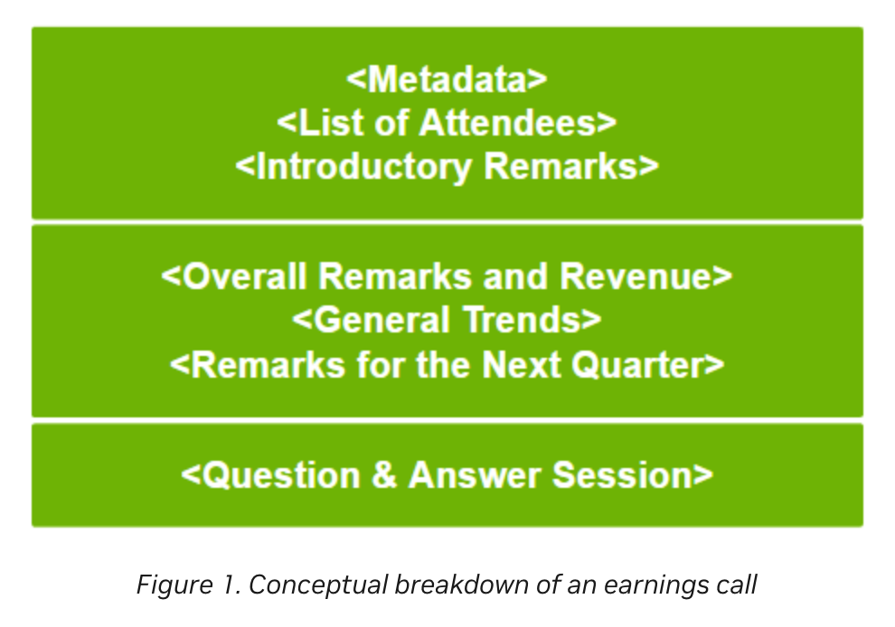

# [Building Your First LLM Agent Application](https://developer.nvidia.com/blog/building-your-first-llm-agent-application/)
簡易まとめ：自分の言葉でまとめたもの。  
GPT翻訳：GPTで翻訳した全文。

# 簡易まとめ
[introduction_to_LLM_Agents](./introduction_to_LLM_Agents.md)で紹介されているように、  
LLM Agentはエージェントコア、メモリモジュール、エージェントツール、および計画モジュールが主要な4つのコンポーネント。  
この記事では、LLM Agentの開発者向けのエコシステムやフレームワークを紹介すると同時に、チュートリアルをする。  

## Developer ecosystem overview for agents
LangChainやLLaMa-Indexのエージェントとして以下が有名。  

- LangChain Agents
- LLaMaIndex Agents
- HayStack Agents
- AutoGen
- AgentVerse
- ChatDev
- Generative Agents

汎用的にどれが良いかという解はなく、ケースバイケースで良いものは変わる。  

### Single-agent frameworks
LangChain、LlamaIndex、Haystackなどがある。  
どれが良いかは、ケースバイケース。  
有向非巡回グラフ（DAG）を用いたいケースなどの特殊な場合、これらのモジュールは有用。  

### Multi-agent frameworks
マルチエージェントは、シングルエージェントとの差は「ワールド」クラスの存在。  
「ワールド」クラスとは、複数のエージェントを管理する、ユーザー、および環境内のツールと相互作用する環境のこと。  

「ワールド」クラスは、やりたいことで変わるので、やりたいことに合わせてこれを設計する必要がある。  

## Recommended reading list for building agents
参考になる情報は以下。    

- [AutoGPT](https://github.com/Significant-Gravitas/AutoGPT)  
最初のエージェントリポジトリ。アーキテクチャとプロンプトが参考になる。  

- [Voyager](https://voyager.minedojo.org/)  
自己改善エージェントの概念などが学べる。  

- [OlaGPT](https://arxiv.org/pdf/2305.16334.pdf)
LLM Agentの基本的な四つのモジュール以外を学べる。  

- [MRKL Systems：大規模言語モデル、外部知識ソース、および離散推論を組み合わせたモジュラー型、ニューロシンボリックアーキテクチャ](https://arxiv.org/abs/2205.00445)
複雑なタスクを実行するために言語モデルとツールを使用するコアメカニズムが提案されている。  

- [Generative Agents：人間の行動のインタラクティブな模倣](https://arxiv.org/abs/2304.03442)
エージェントスウォームの最初の論文。  

- [Awesome LLM-Powered Agentリスト](https://github.com/hyp1231/awesome-llm-powered-agent#awesome-llm-powered-agent)
他にも色々な情報。  

# GPT翻訳
大規模言語モデル（LLM）エージェントアプリケーションを構築する際に必要な4つの主要なコンポーネントがあります：  
エージェントコア、メモリモジュール、エージェントツール、および計画モジュールです。  
質問応答エージェント、マルチモーダルエージェント、またはエージェントのスウォームを設計する際には、オープンソースから本番環境に対応するものまで、多くの実装フレームワークを検討することができます。  
詳細については、「LLMエージェントへの導入」をご覧ください。  

LLMエージェントの開発を初めて試みる方向けに、この投稿では以下を提供します：
- LLMエージェントに関する開発者エコシステムの概要、利用可能なフレームワーク、およびLLMエージェントについて迅速に理解を深めるための推奨読書物を含む  
- あなたの最初のLLM駆動エージェントを構築するための初心者レベルのチュートリアル  

## Developer ecosystem overview for agents
皆さんの多くが、LangChainやLLaMa-Indexエージェントに関する記事を読んだことがあるかもしれません。  
以下に、現在利用可能な実装フレームワークのいくつかを紹介します：  

- LangChain Agents
- LLaMaIndex Agents
- HayStack Agents
- AutoGen
- AgentVerse
- ChatDev
- Generative Agents

どのフレームワークが良いか？の回答は「ケースによる」になります。  

### Single-agent frameworks
LLMアプリケーション開発エコシステムをさらに推進するために、コミュニティによって構築されたいくつかのフレームワークがあり、エージェントの開発への容易な道を提供しています。  
人気のあるフレームワークの例としては、LangChain、LlamaIndex、Haystackなどがあります。  
これらのフレームワークは、汎用エージェントクラス、コネクター、メモリモジュール用の機能、サードパーティツールへのアクセス、データ取得および取り込みメカニズムを提供します。  

どのフレームワークを選択するかは、主にあなたのパイプラインの詳細と要件によって決まります。  
論理フローのような有向非巡回グラフ（DAG）を持つ複雑なエージェントを構築する必要がある場合、またはユニークなプロパティを持つ場合、  
これらのフレームワークはプロンプトや一般的なアーキテクチャに関してあなた自身のカスタム実装のための良い参照点を提供します。  

### Multi-agent frameworks
「マルチエージェントフレームワークでは何が異なるのか？」と疑問に思うかもしれません。  
短い答えは「ワールド」クラスです。  
複数のエージェントを管理するためには、彼らが互い、ユーザー、および環境内のツールと相互作用する環境、つまり「ワールド」を設計する必要があります。  

ここでの課題は、アプリケーションごとにワールドが異なるということです。  
必要なのは、シミュレーション環境を構築するためのカスタムメイドのツールキットであり、ワールドの状態を管理し、エージェントのための汎用クラスを持つものです。  
また、エージェント間のトラフィックを管理するための通信プロトコルの確立も必要です。  
OSSフレームワークの選択は、構築しているアプリケーションのタイプと必要なカスタマイズのレベルに依存します。  

## Recommended reading list for building agents
エージェントが可能にすることを探るための思考を刺激する資料やリソースは豊富にありますが、  
エージェントの全体的なエートスをカバーするための優れた出発点となるリソースは以下の通りです：  

- [AutoGPT](https://github.com/Significant-Gravitas/AutoGPT)：このGitHubプロジェクトは、エージェントが提供できる能力を示すために構築された最初の真のエージェントの一つでした。プロジェクトで使用されている一般的なアーキテクチャとプロンプティング技術を見ることは非常に役立ちます。
- [Voyager](https://voyager.minedojo.org/)：NVIDIA Researchからのこのプロジェクトは、新しいツールを使用する方法を学んだり、外部の介入なしにツールを構築したりする自己改善エージェントの概念に触れています。
- [OlaGPT](https://arxiv.org/pdf/2305.16334.pdf)：OlaGPTのようなエージェントの概念フレームワークは、基本的な四つのモジュールを持つ単純なエージェントを超えていく方法についてのアイデアを刺激する素晴らしい出発点です。
- [MRKL Systems：大規模言語モデル、外部知識ソース、および離散推論を組み合わせたモジュラー型、ニューロシンボリックアーキテクチャ](https://arxiv.org/abs/2205.00445)：この論文は、複雑なタスクを実行するために言語モデルとツールを使用するためのコアメカニズムを初めて提案しました。
- [Generative Agents：人間の行動のインタラクティブな模倣](https://arxiv.org/abs/2304.03442)：これは、相互にやり取りする複数のエージェントから成る解決策、真のエージェントのスウォームを構築した最初のプロジェクトの一つでした。

さらに読む資料を探している場合、[Awesome LLM-Powered Agentリスト](https://github.com/hyp1231/awesome-llm-powered-agent#awesome-llm-powered-agent)が役立つと私は思います。  

## Tutorial: Build a question-answering agent
このチュートリアルでは、データと対話を助けることができる質問応答（QA）エージェントを構築します。  

比較的単純なエージェントでもかなり難しい課題に対処できることを示すために、収益コールから情報を掘り出すことができるエージェントを構築します。  
収益コールの文字起こしを見ることができます。  
図1は収益コールの一般的な構造を示しており、このチュートリアルで使用されるファイルを理解できるようになっています。  

この投稿の終わりまでに、あなたが構築するエージェントは、以下のような複雑で層を持った質問に答えることができるようになります：  

- 2024年Q1から2024年Q2にかけて収入はどれだけ成長しましたか？  
- FY24のQ2からの主要なポイントは何でしたか？  

[introduction_to_LLM_Agents](./introduction_to_LLM_Agents.md)の通り4つのコンポーネントがあります。  
- tools
- planning module
- memory
- agent core

### Tools

### Planning module

### Memory

### Evaluate the mental model

### Agent core

#### Linear solver

#### Single-thread recursive solver

