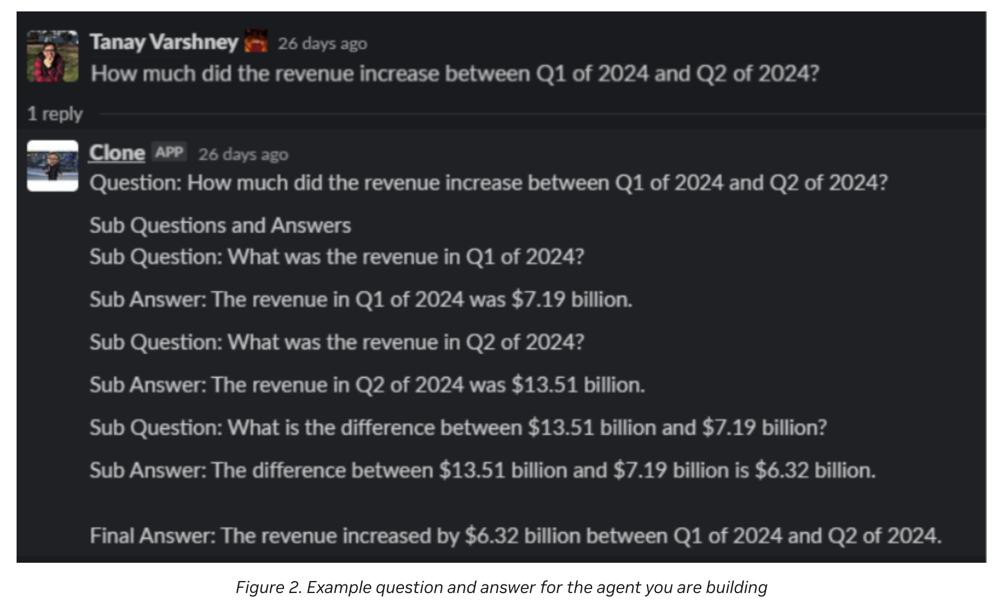

# [Building Your First LLM Agent Application](https://developer.nvidia.com/blog/building-your-first-llm-agent-application/)
簡易まとめ：自分の言葉でまとめたもの。  
GPT翻訳：GPTで翻訳した全文。

# 簡易まとめ
[introduction_to_LLM_Agents](./introduction_to_LLM_Agents.md)で紹介されているように、  
LLM Agentはエージェントコア、メモリモジュール、エージェントツール、および計画モジュールが主要な4つのコンポーネント。  
この記事では、LLM Agentの開発者向けのエコシステムやフレームワークを紹介すると同時に、チュートリアルをする。  

## Developer ecosystem overview for agents
LangChainやLLaMa-Indexのエージェントとして以下が有名。  

- LangChain Agents
- LLaMaIndex Agents
- HayStack Agents
- AutoGen
- AgentVerse
- ChatDev
- Generative Agents

汎用的にどれが良いかという解はなく、ケースバイケースで良いものは変わる。  

### Single-agent frameworks
LangChain、LlamaIndex、Haystackなどがある。  
どれが良いかは、ケースバイケース。  
有向非巡回グラフ（DAG）を用いたいケースなどの特殊な場合、これらのモジュールは有用。  

### Multi-agent frameworks
マルチエージェントは、シングルエージェントとの差は「ワールド」クラスの存在。  
「ワールド」クラスとは、複数のエージェントを管理する、ユーザー、および環境内のツールと相互作用する環境のこと。  

「ワールド」クラスは、やりたいことで変わるので、やりたいことに合わせてこれを設計する必要がある。  

## Recommended reading list for building agents
参考になる情報は以下。    

- [AutoGPT](https://github.com/Significant-Gravitas/AutoGPT)  
最初のエージェントリポジトリ。アーキテクチャとプロンプトが参考になる。  

- [Voyager](https://voyager.minedojo.org/)  
自己改善エージェントの概念などが学べる。  

- [OlaGPT](https://arxiv.org/pdf/2305.16334.pdf)
LLM Agentの基本的な四つのモジュール以外を学べる。  

- [MRKL Systems：大規模言語モデル、外部知識ソース、および離散推論を組み合わせたモジュラー型、ニューロシンボリックアーキテクチャ](https://arxiv.org/abs/2205.00445)
複雑なタスクを実行するために言語モデルとツールを使用するコアメカニズムが提案されている。  

- [Generative Agents：人間の行動のインタラクティブな模倣](https://arxiv.org/abs/2304.03442)
エージェントスウォームの最初の論文。  

- [Awesome LLM-Powered Agentリスト](https://github.com/hyp1231/awesome-llm-powered-agent#awesome-llm-powered-agent)
他にも色々な情報。  

## Tutorial: Build a question-answering agent
回答のためのタスク分解をする質問応答（QA）エージェントを構築する。
対象は、収支報告データ。  
図1は収支報告の概要。(intro/全体・トレンド・次Qの内容/質疑)  


この収支報告から、以下の質問に答えられるエージェントを構築する。
- 2024年Q1から2024年Q2にかけて収入はどれだけ成長しましたか？  
- FY24のQ2からの主要なポイントは何でしたか？  



図では、質問に対して分解した質問と解答の対応と、最終解答が表示されてて凄い。  

以下、4つのコンポーネントの説明。  
1. tools
2. planning module
3. memory
4. agent core

### 1. Tools
以下の2つのツールを用意する。  
- RAGパイプライン  
- 数学ツール  
(この記事では使っていないが、本番環境向けの数学ツールはWolframAlphaがおすすめらしい。)  

### 2. Planning module
質問を分割するためのモジュール。  
例えば、「2024年の第1四半期と第2四半期の間で、収益はどれだけ成長しましたか？」は三つの質問に分解できる。  

- 第1四半期の収益はいくらでしたか？
- 第2四半期の収益はいくらでしたか？
- そして、その二つの違いは何ですか？

planning moduleは以下のようなイメージ。  

```
decomp_template = """GENERAL INSTRUCTIONS
You are a domain expert. Your task is to break down a complex question into simpler sub-parts.
 
USER QUESTION
{{user_question}}
 
ANSWER FORMAT
{"sub-questions":["<FILL>"]}"""
```

これをテストすると、以下の図のようになり、sub-questionsに分割できていることが確認できる。  


これ、他の色んなタスクでも同じようにいい感じに分割してくれるんかな？？？？

### Memory
質問と解答を保持するメモリモジュール。  
以下のように質問と解答をリストで保持しておく。  

```
class Ledger:
    def __init__(self):
        self.question_trace = []
        self.answer_trace = []
```

質問解答のペアを保持しつつ、まだ解答していないなども把握できる。  

### Evaluate the mental model
最後のエージェントコアの前に、改めてここまでで作ったものは以下。  

- 検索と数学計算を行うツール
- 質問を分解するためのプランナー
- 尋ねられた質問を追跡するためのメモリモジュール

この3つが機能するかを以下の図のように確認することができる。  


```
template = """GENERAL INSTRUCTIONS
Your task is to answer questions. If you cannot answer the question, request a helper or use a tool. Fill with Nil where no tool or helper is required.
 
AVAILABLE TOOLS
- Search Tool
- Math Tool
 
AVAILABLE HELPERS
- Decomposition: Breaks Complex Questions down into simpler subparts
 
CONTEXTUAL INFORMATION
<No previous questions asked>
 
QUESTION
How much did the revenue grow between Q1 of 2024 and Q2 of 2024?
 
ANSWER FORMAT
{"Tool_Request": "<Fill>", "Helper_Request "<Fill>"}"""
```

「How much did the revenue grow between Q1 of 2024 and Q2 of 2024?」  
に対して、検索ツールの利用を選択したことがわかる。これは妥当だが解答が見つからなかったとする。  
その結果が以下の図。  
「the tool cannot answer this question」がcontextに加わることで、  
helper_requestにDecompositionが入り、ツールで解決できないから分解することを選択している。  


これで、ツールの利用、タスク分解、メモリの利用が機能していることが確認できる。  
これをpythonで簡易的に表現すると以下のようになる。  

詳細な説明はないが、`prompt_core_llm`が質問に対して回答を返す関数で、  
toolを使うか、plannerを使うかなどが判定される。  
それらの結果はmemoryに格納され、memoryの内容で最終解答を出力する感じ。  

```
def agent_core(question):
    answer_dict = prompt_core_llm(question, memory)
    update_memory()
    if answer_dict[tools]:
        execute_tool()
        update_memory()
    if answer_dict[planner]:
        questions = execute_planner()
        update_memory()
    if no_new_questions and no tool request:
        return generate_final_answer(memory)
```

### Agent core
上記でエージェントコアが作れたが、このフローを実行するメカニズムを定義する必要がある。  
三つの主要な選択肢がある。  

#### 1. Linear solver
ツールを利用して単一のタスクを実施する方法。  

#### 2. Single-thread recursive solver
再起的にタスクを解く方法で、イメージは以下。  

実施すべきことがDecompositionやtool利用だった場合、その結果を再度エージェントコアに投入する。  
タスクが最小単位まで分解され、ツール利用が終わったら、最終結果を生成する。  

```
def Agent_Core(Question, Context):
    Action = LLM(Context + Question)
 
    if Action == "Decomposition":
        Sub Questions = LLM(Question)
        Agent_Core(Sub Question, Context)
 
    if Action == "Search Tool":
        Answer = RAG_Pipeline(Question)
        Context = Context + Answer
        Agent_Core(Question, Context)
 
    if Action == "Gen Final Answer”:
        return LLM(Context)
 
    if Action == "<Another Tool>":
        <Execute Another Tool>
```

#### Multi-thread recursive solver
シングルスレッドを並列実行するパターン。  
複雑になるが、処理時間の向上が期待できる。  

## NEXT
本番環境向けのRAGパイプラインの構築:[NVIDIA/GenerativeAIExamples](https://nvda.ws/41gNtfJ)

他のタイプのLLMエージェントについて学びたい:  
[タスク実行のためのLLMパワードAPIエージェントの構築(https://developer.nvidia.com/blog/build-an-llm-powered-api-agent-for-task-execution/)  
[データ分析のためのLLMパワードデータエージェントの構築](https://developer.nvidia.com/blog/build-an-llm-powered-data-agent-for-data-analysis/)  

  
  
# GPT翻訳
大規模言語モデル（LLM）エージェントアプリケーションを構築する際に必要な4つの主要なコンポーネントがあります：  
エージェントコア、メモリモジュール、エージェントツール、および計画モジュールです。  
質問応答エージェント、マルチモーダルエージェント、またはエージェントのスウォームを設計する際には、オープンソースから本番環境に対応するものまで、多くの実装フレームワークを検討することができます。  
詳細については、「LLMエージェントへの導入」をご覧ください。  

LLMエージェントの開発を初めて試みる方向けに、この投稿では以下を提供します：
- LLMエージェントに関する開発者エコシステムの概要、利用可能なフレームワーク、およびLLMエージェントについて迅速に理解を深めるための推奨読書物を含む  
- あなたの最初のLLM駆動エージェントを構築するための初心者レベルのチュートリアル  

## Developer ecosystem overview for agents
皆さんの多くが、LangChainやLLaMa-Indexエージェントに関する記事を読んだことがあるかもしれません。  
以下に、現在利用可能な実装フレームワークのいくつかを紹介します：  

- LangChain Agents
- LLaMaIndex Agents
- HayStack Agents
- AutoGen
- AgentVerse
- ChatDev
- Generative Agents

どのフレームワークが良いか？の回答は「ケースによる」になります。  

### Single-agent frameworks
LLMアプリケーション開発エコシステムをさらに推進するために、コミュニティによって構築されたいくつかのフレームワークがあり、エージェントの開発への容易な道を提供しています。  
人気のあるフレームワークの例としては、LangChain、LlamaIndex、Haystackなどがあります。  
これらのフレームワークは、汎用エージェントクラス、コネクター、メモリモジュール用の機能、サードパーティツールへのアクセス、データ取得および取り込みメカニズムを提供します。  

どのフレームワークを選択するかは、主にあなたのパイプラインの詳細と要件によって決まります。  
論理フローのような有向非巡回グラフ（DAG）を持つ複雑なエージェントを構築する必要がある場合、またはユニークなプロパティを持つ場合、  
これらのフレームワークはプロンプトや一般的なアーキテクチャに関してあなた自身のカスタム実装のための良い参照点を提供します。  

### Multi-agent frameworks
「マルチエージェントフレームワークでは何が異なるのか？」と疑問に思うかもしれません。  
短い答えは「ワールド」クラスです。  
複数のエージェントを管理するためには、彼らが互い、ユーザー、および環境内のツールと相互作用する環境、つまり「ワールド」を設計する必要があります。  

ここでの課題は、アプリケーションごとにワールドが異なるということです。  
必要なのは、シミュレーション環境を構築するためのカスタムメイドのツールキットであり、ワールドの状態を管理し、エージェントのための汎用クラスを持つものです。  
また、エージェント間のトラフィックを管理するための通信プロトコルの確立も必要です。  
OSSフレームワークの選択は、構築しているアプリケーションのタイプと必要なカスタマイズのレベルに依存します。  

## Recommended reading list for building agents
エージェントが可能にすることを探るための思考を刺激する資料やリソースは豊富にありますが、  
エージェントの全体的なエートスをカバーするための優れた出発点となるリソースは以下の通りです：  

- [AutoGPT](https://github.com/Significant-Gravitas/AutoGPT)：このGitHubプロジェクトは、エージェントが提供できる能力を示すために構築された最初の真のエージェントの一つでした。プロジェクトで使用されている一般的なアーキテクチャとプロンプティング技術を見ることは非常に役立ちます。
- [Voyager](https://voyager.minedojo.org/)：NVIDIA Researchからのこのプロジェクトは、新しいツールを使用する方法を学んだり、外部の介入なしにツールを構築したりする自己改善エージェントの概念に触れています。
- [OlaGPT](https://arxiv.org/pdf/2305.16334.pdf)：OlaGPTのようなエージェントの概念フレームワークは、基本的な四つのモジュールを持つ単純なエージェントを超えていく方法についてのアイデアを刺激する素晴らしい出発点です。
- [MRKL Systems：大規模言語モデル、外部知識ソース、および離散推論を組み合わせたモジュラー型、ニューロシンボリックアーキテクチャ](https://arxiv.org/abs/2205.00445)：この論文は、複雑なタスクを実行するために言語モデルとツールを使用するためのコアメカニズムを初めて提案しました。
- [Generative Agents：人間の行動のインタラクティブな模倣](https://arxiv.org/abs/2304.03442)：これは、相互にやり取りする複数のエージェントから成る解決策、真のエージェントのスウォームを構築した最初のプロジェクトの一つでした。

さらに読む資料を探している場合、[Awesome LLM-Powered Agentリスト](https://github.com/hyp1231/awesome-llm-powered-agent#awesome-llm-powered-agent)が役立つと私は思います。  

## Tutorial: Build a question-answering agent
このチュートリアルでは、データと対話を助けることができる質問応答（QA）エージェントを構築します。  

比較的単純なエージェントでもかなり難しい課題に対処できることを示すために、収益コールから情報を掘り出すことができるエージェントを構築します。  
収益コールの文字起こしを見ることができます。  
図1は収益コールの一般的な構造を示しており、このチュートリアルで使用されるファイルを理解できるようになっています。  


この投稿の終わりまでに、あなたが構築するエージェントは、以下のような複雑で層を持った質問に答えることができるようになります：  

- 2024年Q1から2024年Q2にかけて収入はどれだけ成長しましたか？  
- FY24のQ2からの主要なポイントは何でしたか？  


[introduction_to_LLM_Agents](./introduction_to_LLM_Agents.md)の通り4つのコンポーネントがあります。  
- tools
- planning module
- memory
- agent core

### Tools
LLMエージェントを構築するには、以下のツールが必要です：
- リトリーバル拡張生成（RAG）パイプライン
データと会話する問題を解決するには、RAGが不可欠です。  
したがって、必要なツールの一つはRAGパイプラインです。  
本番環境向けのRAGパイプラインの構築方法についての詳細は、GitHubのリポジトリを参照してください。  
- 数学ツール
また、あらゆるタイプの分析を行うために数学ツールも必要です。  
この投稿を簡単にするために、数学の質問に答えるためにLLMを使用しますが、本番アプリケーションにはWolframAlphaのようなツールをお勧めします。  

### Planning module
このLLMエージェントを使用すると、「2024年の第1四半期と第2四半期の間で、収益はどれだけ成長しましたか？」といった質問に答えることができます。  
根本的には、これは一つにまとめられた三つの質問です：  

- 第1四半期の収益はいくらでしたか？
- 第2四半期の収益はいくらでしたか？
- そして、その二つの違いは何ですか？

- 答えは、質問分解モジュールを構築する必要があることです：  

```
decomp_template = """GENERAL INSTRUCTIONS
You are a domain expert. Your task is to break down a complex question into simpler sub-parts.
 
USER QUESTION
{{user_question}}
 
ANSWER FORMAT
{"sub-questions":["<FILL>"]}"""
```


### Memory
次に、尋ねられたすべての質問を追跡するため、または単にすべてのサブ質問とそれらの質問に対する回答のリストを保持するために、  
メモリモジュールを構築する必要があります。  

```
class Ledger:
    def __init__(self):
        self.question_trace = []
        self.answer_trace = []
```

これを実現するには、二つのリストから成るシンプルな元帳を使用します。  
一つはすべての質問を追跡するためのもので、もう一つはすべての回答を追跡するためのものです。  
これにより、エージェントは自身が答えた質問とまだ答えていない質問を覚えておくことができます。

### Evaluate the mental model
エージェントコアを構築する前に、現時点で何を持っているかを評価してください：  

- 検索と数学計算を行うツール
- 質問を分解するためのプランナー
- 尋ねられた質問を追跡するためのメモリモジュール

- この時点で、これらを結びつけて、それが精神モデルとして機能するかどうかを確認することができます（図4）。  


```
template = """GENERAL INSTRUCTIONS
Your task is to answer questions. If you cannot answer the question, request a helper or use a tool. Fill with Nil where no tool or helper is required.
 
AVAILABLE TOOLS
- Search Tool
- Math Tool
 
AVAILABLE HELPERS
- Decomposition: Breaks Complex Questions down into simpler subparts
 
CONTEXTUAL INFORMATION
<No previous questions asked>
 
QUESTION
How much did the revenue grow between Q1 of 2024 and Q2 of 2024?
 
ANSWER FORMAT
{"Tool_Request": "<Fill>", "Helper_Request "<Fill>"}"""
```

LLMが検索ツールの使用を要求したことがわかります。  
これは論理的なステップです。  
なぜなら、答えはコーパスに含まれている可能性が高いからです。  
しかし、いずれのトランスクリプトにも答えが含まれていないことが分かっています。  
次のステップ（図5）では、RAGパイプラインからの入力を提供し、答えが利用可能ではなかったとします。  
その結果、エージェントは質問をより単純なサブパートに分解することに決定します。  


この演習により、ロジックの核心メカニズムが健全であることが確認されました。  
LLMは、必要に応じてツールやヘルパーを選択しています。  

今、残っているのは、これをPython関数にきれいにラップすることです。  
その関数は、以下のコード例のようになるでしょう：  

```
def agent_core(question):
    answer_dict = prompt_core_llm(question, memory)
    update_memory()
    if answer_dict[tools]:
        execute_tool()
        update_memory()
    if answer_dict[planner]:
        questions = execute_planner()
        update_memory()
    if no_new_questions and no tool request:
        return generate_final_answer(memory)
```

### Agent core
エージェントコアの例を見たばかりですが、残っているのは何でしょうか？  
実は、全ての部分を結びつけるだけでは、エージェントコアにはもう少し多くのことがあります。  
エージェントがそのフローを実行するメカニズムを定義する必要があります。  
基本的に三つの主要な選択肢があります：  

#### Linear solver
これは、以前に議論した実行のタイプです。  
エージェントがツールを使用し、一段階の計画を行う単一のリニアチェーンのソリューションがあります。  
これはシンプルなセットアップですが、真に複雑で繊細な質問には、多層的な思考がしばしば必要です。  

#### Single-thread recursive solver
また、オリジナルの質問が答えられるまでの質問と回答の木を構築する再帰ソルバーも構築できます。  
この木は深さ優先探索で解かれます。  
以下のコード例はそのロジックを示しています：  

```
def Agent_Core(Question, Context):
    Action = LLM(Context + Question)
 
    if Action == "Decomposition":
        Sub Questions = LLM(Question)
        Agent_Core(Sub Question, Context)
 
    if Action == "Search Tool":
        Answer = RAG_Pipeline(Question)
        Context = Context + Answer
        Agent_Core(Question, Context)
 
    if Action == "Gen Final Answer”:
        return LLM(Context)
 
    if Action == "<Another Tool>":
        <Execute Another Tool>
```

#### Multi-thread recursive solver
木を反復的に解く代わりに、木の各ノードに対して並行実行スレッドを分岐させることができます。  
この方法は実行の複雑さを増加させますが、LLMの呼び出しが並行して処理されるため、大幅なレイテンシの利点をもたらします。  

## Summary
LLMを動力とするエージェントは、複雑な推論スキルを持つ点で、典型的なチャットボットアプリケーションとは異なります。  
エージェントコア、メモリモジュール、ツールのセット、および計画モジュールから構成されるエージェントは、  
データキュレーションから高度なeコマース推薦システムまで、さまざまな企業設定で非常にパーソナライズされた回答とコンテンツを生成することができます。

さらに進む準備はできましたか？本番環境向けのRAGパイプラインを構築するには、GitHubの[NVIDIA/GenerativeAIExamples](https://nvda.ws/41gNtfJ)を訪れてください。

他のタイプのLLMエージェントについて学ぶには、[タスク実行のためのLLMパワードAPIエージェントの構築(https://developer.nvidia.com/blog/build-an-llm-powered-api-agent-for-task-execution/)と  
[データ分析のためのLLMパワードデータエージェントの構築](https://developer.nvidia.com/blog/build-an-llm-powered-data-agent-for-data-analysis/)をご覧ください。
