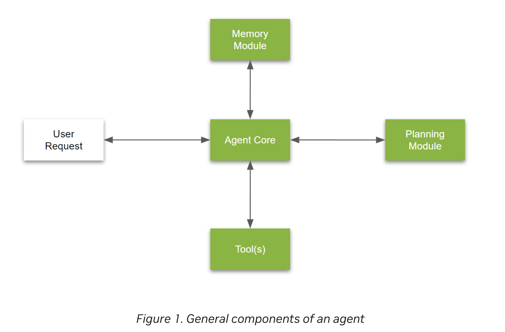
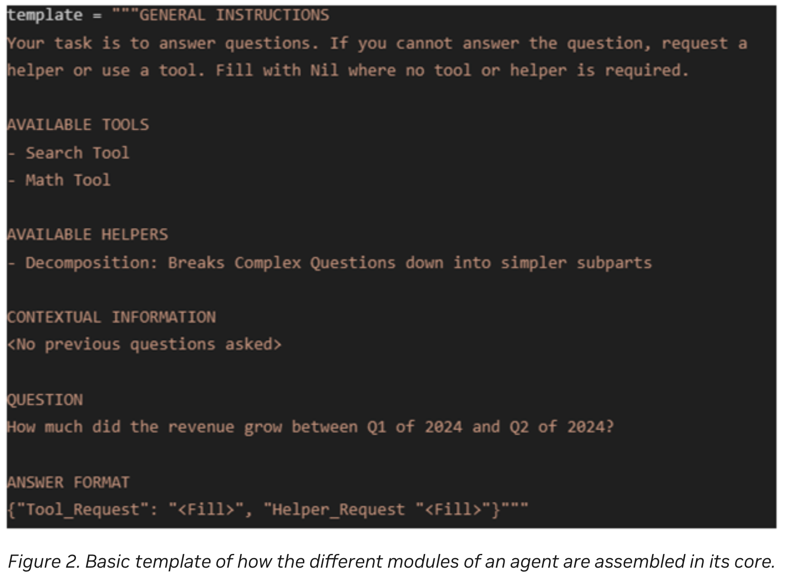

# Introduction to LLM Agents

## 簡易まとめ
LLMで「ある会社の2023年2Qの収支報告のポイントを3つと、技術的な優位性について説明してください」のような質問をする場合、  
単純な検索では実現不可能で、複数の役割に分解して、解答を生成する必要がある。  
このように、複数の動きをすることを可能にするものをLLMエージェントと呼ぶ。  

## What is an AI agent?
「LLMエージェント」には明確な定義はないが、要求を理解し、それを可能にする計画を作成してツールを利用しながら実行するシステムと言える。 
LLMエージェントは、4つのコンポーネントで構成される。
- Agent core
- Memory module
- Tools
- Planning module

### Agent core
Agent coreは、エージェントの真ん中に位置する調整モジュールであり、コアロジックと行動特性を管理する。  
エージェントとしての目標、利用するツール、計画モジュール(planning module)の記述、過去のやりとりなどの関連情報、エージェントのペルソナ(オプショナル)などを定義する。  

agent coreのプロンプトの例  

General Instructions: エージェントの目的を記載  
Available tools: 利用できるツールを記載  
Available helpers: 利用できる計画モジュールの説明の記載  
Contextual Information: 関連情報の記載  
Question: 質問の記載  
Answer format: 回答の形式の記載  

### Memory module

## GPT翻訳
金融アナリストが企業の業績に関する質問に答えるのを助けるために設計された大規模言語モデル（LLM）アプリケーションを考えてみましょう。  
よく設計された検索強化生成（RAG）パイプラインを使用することで、アナリストは「X社の2022会計年度の総収入は何でしたか？」のような質問に答えることができます。  
この情報は、経験豊富なアナリストによって財務諸表から簡単に抽出することができます。  

次に、「2023会計年度の第2四半期の収支報告からの3つのポイントは何でしたか？ 会社が築いている技術的な優位性に焦点を当ててください」という質問を考えてみましょう。  
これは、金融アナリストがレポートに含めたいと考えるタイプの質問ですが、答えるためには時間を投資する必要があります。  

上記のような質問に答える解決策をどのように開発しますか？  
この情報が収支報告からの単純な検索以上のものを要求していることはすぐに明らかです。  
この問いは、計画、特定の焦点、記憶、異なるツールの使用、複雑な質問をよりシンプルなサブパートに分解することを要求します。  
これらの概念を組み合わせたものは、本質的に私たちがLLMエージェントと呼ぶようになったものです。  

この投稿では、LLMを搭載したエージェントについて紹介し、エージェントとは何か、および企業向けアプリケーションの使用例について説明します。  
詳細については、[最初のエージェントアプリケーションの構築(https://developer.nvidia.com/blog/building-your-first-llm-agent-application/)をご覧ください。  
その投稿では、AIエージェントを構築するための利用可能なフレームワークと、質問応答（Q&A）エージェントを実験している人のための入門ガイドをカバーするエコシステムのウォークスルーを提供しています。  

## What is an AI agent?
LLMを搭載したエージェントには広く受け入れられた定義はありませんが、問題を推論し、問題を解決するための計画を作成し、一連のツールの助けを借りて計画を実行できるシステムとして説明することができます。  

簡単に言うと、エージェントは複雑な推論能力、記憶、およびタスクを実行する手段を持ったシステムです。  

この能力は、AutoGPTやBabyAGIのようなプロジェクトで最初に観察されました。  
ここでは、多くの介入なしに複雑な問題が解決されました。  
エージェントをもう少し詳しく説明するために、LLMを搭載したエージェントアプリケーションの一般的なアーキテクチャをここに示します（図1）。

エージェントは、4つの主要なコンポーネントで構成されています。
- Agent core
- Memory module
- Tools
- Planning module

### Agent core
エージェントコアは、エージェントの中心的な調整モジュールであり、エージェントのコアロジックと行動特性を管理します。  
これをエージェントの「主要な意思決定モジュール」と考えてください。  
また、以下を定義する場所でもあります。  

- エージェントの一般的な目標  
エージェントの全体的な目標と目的を含みます。  

- 実行のためのツール  
本質的にエージェントがアクセスできるすべてのツールの短いリストや「ユーザーマニュアル」です。  

- 異なる計画モジュールの使用方法についての説明  
異なる計画モジュールの有用性についての詳細や、どの状況でどれを使用するかについてです。  

- 関連する記憶  
これは、推論時にユーザーとの過去の会話から最も関連性の高い記憶項目を記録する動的なセクションです。  
「関連性」は、ユーザーが尋ねる質問を使用して決定されます。  

- エージェントのペルソナ（オプション）
このペルソナの説明は、一般的に、モデルに特定のタイプのツールの使用を優先するようにバイアスをかけるか、またはエージェントの最終的な反応に典型的な特異性を付与するために使用されます。  

### Memory module
AIエージェントにおいて、メモリモジュールは重要な役割を果たします。  
メモリモジュールは、基本的にはエージェントの内部ログおよびユーザーとの相互作用の保存庫と考えることができます。  

メモリモジュールには2種類あります：  
- 短期記憶  
エージェントがユーザーからの単一の質問に答えようとする際に経験する行動や考えの台帳。  
エージェントの「思考の流れ」です。  

- 長期記憶  
ユーザーとエージェントの間で起こるイベントについての行動や考えの台帳。  
数週間または数ヶ月にわたる会話履歴を含むログブックです。  
メモリは、意味的類似性に基づく検索以上のものを要求します。  
通常、意味的類似性、重要性、最新性、その他のアプリケーション固有の指標から成る複合スコアが作成されます。  
これは、特定の情報を取得するために使用されます。  

## 単語
- tailored focus: 適切な焦点
- earnings call: 収支報告
- In short: 要するに(簡単にいうと)