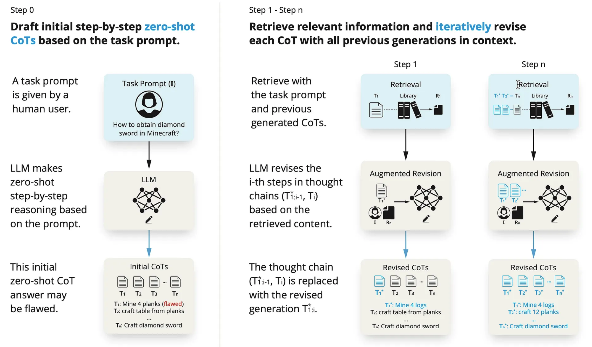
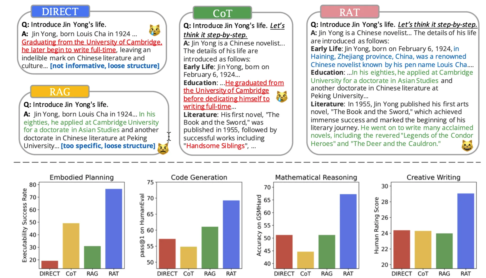
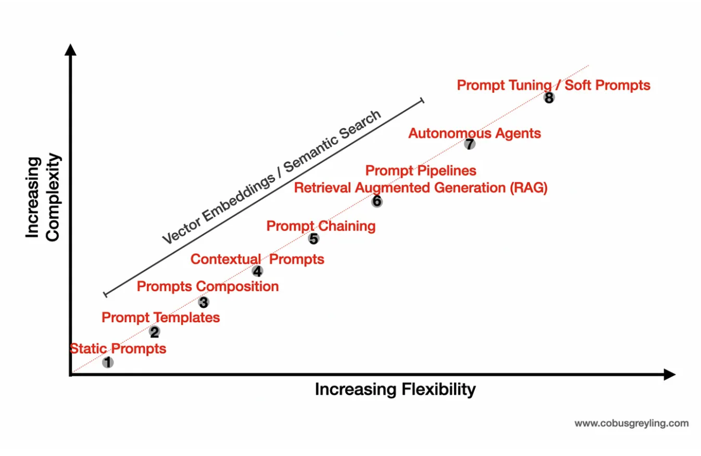
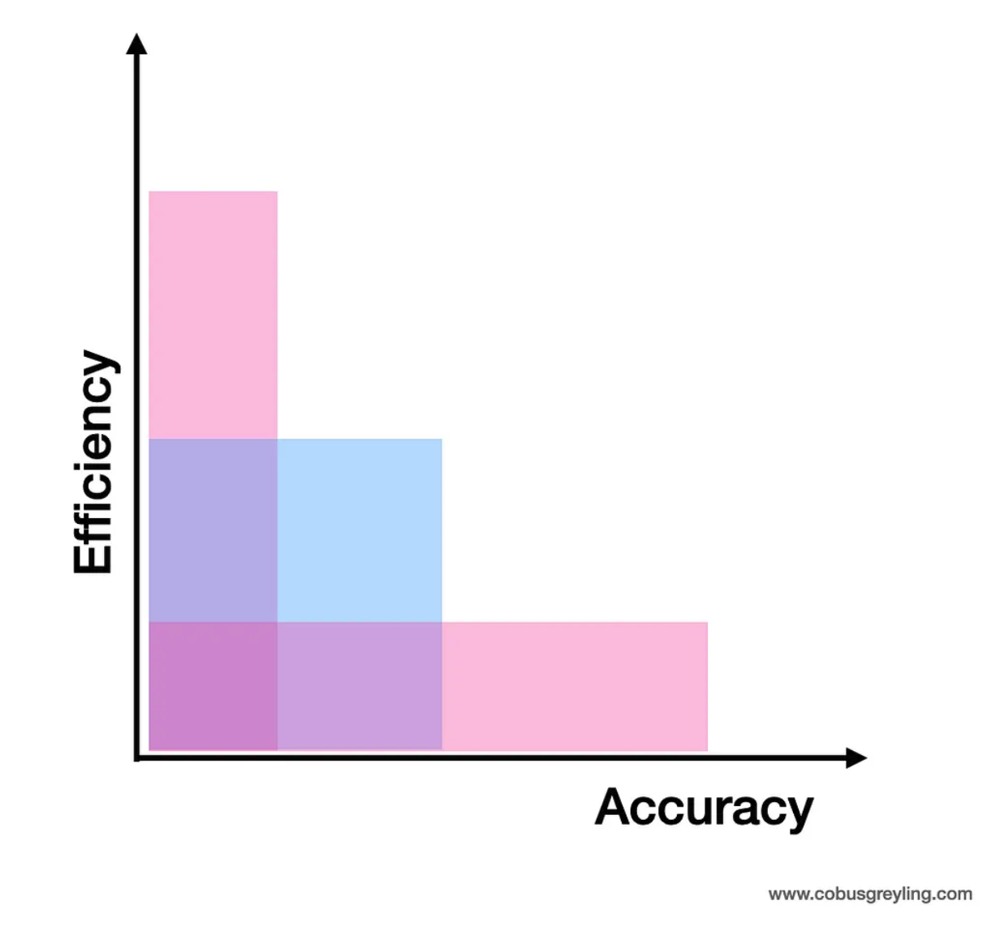

# [RAT — Retrieval Augmented Thoughts](https://cobusgreyling.medium.com/rat-retrieval-augmented-thoughts-c7eb0cf5547c)
## 簡易まとめ
### introduction
Generative AI APP(以下、GenAPP)は、アプリケーションの処理効率と回答の正確性にトレードオフがある。  
ここでの正確性は、ユーザーの期待する回答を返却することを指す。  
GenAPPでは、複数のLLMを組み合わせるため、正確性の高い組み合わせを見つける必要がある。  
しかし、これが複雑すぎると処理効率が落ちることになる。よって、トレードオフの関係にある。  

### RAT Two-Step Approach
Retrieval Augmented Thoughts(RAT)は、Chain of Thought(CoT)プロンプティングとRetrieval Augmented Generation(RAG)を組み合わせる。  
これは、シンプルだが効果的なプロンプティング戦略で、長期的な推論とその生成に対処するための方法である。  

LLMによってzero-shotでCoTを作り、これをRAGと組み合わせて使う。  
得られたCoTをクエリとして扱い、このクエリ自体をブラッシュアップすることで少しずつ最終の回答を作り上げていく。  

RATはゼロショットプロンプティングアプローチであるため、通常のCoTやRAGよりも優れている。  
特に、コード生成・数学的推論・タスクプランニング・文章作成において顕著である。  

#### Step one
まず、大元の質問文を元にゼロショットCoTプロンプティングで、CoT自体を修正するのに必要なタスクを生成する。  

#### Step two
その後、CoT(サブタスク)に基づいてステップバイステップで回答を生成していく。  

ステップバイステップで回答を生成する際に、現在のステップで対象とすることだけに注目し、それまでのステップに基づいてクエリを見直す。  
この考え方は、人間が普段やっている思考に似ているアプローチである。  

### Long-Horizon Manipulation(CoTのサブタスクが長い時の操作)
長期的なCoTタスクは、一連の行動と継続的な制御のためのパラメータ(各ステップをどれくらいやるのか？)の考慮が必要である。
よって、ゼロショットCoTプロンプティングとこれを長く連結したタスクは難易度が高い。  
そのため、多段階かつコンテキストを意識した推論が必要となる。  

すなわち、各ステップのタスクは、「事実に基づく」ことが不可欠である可能性がある。  

図1に、RATのパイプラインを示す。  
タスクプロンプト（図のI）が与えられ、ゼロショットでLLMによって生成された初期のステップバイステップの思考（𝑇_1 , 𝑇_2 , · · · , 𝑇_n）を出力する。
各ステップには、ハルシネーションのリスクがある一方、RAGを使用して、各思考ステップの修正が可能である。  

図1: RATのパイプライン  
  

図2にLLMの推論方法と生成された回答例を示す。  
図の上の文章内で、赤いテキストは誤りや幻覚を示し、緑のテキストは正しい生成箇所である。  

DORECTやCoTは、赤(誤り・幻覚)があるが、RAGとRATには存在しない。  
RAGも悪くないが、RATの方が回答の質が高くなっている。  
これは、各ステップが「事実に基づく」ことに非常に有用である。  

図2: LLMの推論方法と生成された回答  
  

### in Closing
「Agentic RAG」は、LlamaIndexが最初に用いた言葉で、「LLMに基づく自律エージェントをRAGと組み合わせること」と定義されている。  

Agentic RAGエージェントは、RAGサブツールとも呼ばれる複数の下位オーダーのサブエージェントにアクセスできる特徴がある。  
RATを概念化するこの記事のアプローチは、Agentic RAGアプローチと整合が取れている。  
すなわち似たような動きが、各所にて見られている。  
プロンプト周りの複雑さが増すにつれて、RAG周りの複雑さも増していく。  
以下の画像のように、静的なプロンプトから始まり、テンプレーティング、自律エージェントまで来ている。  

RAGにおいても同様のことが発生しており、RAGの実装に構造と複雑さが加わっていく。
きっとこの流れは本流となる。  

## GPT翻訳
### Introduction
はじめに、いくつかの一般的な観察から始めさせていただきます…  

生成型AIアプリケーション内での効率性と生成された応答の正確性の間には緊張関係があります。  
GenAppの効率性とは、アプリケーションが遅延やタイムアウトなしに迅速に応答することを指します。  
また、実行パス内のコンポーネントやチェックが多すぎてはなりません。  

正確性とは、生成型AIアプリからの出力がユーザーの期待と一致することを指します。  
GenAppのアーキテクチャでは、多くの場合、複数のLLM(大規模言語モデル)のインタラクションと推論パスを用いて正確性を達成します。  
これに、異なる応答を比較して最適な応答を選択する作業が加わります。  

明らかに、高いレベルの正確性を達成するためにこれらの措置を導入すると、効率性が損なわれます。  
したがって、効率性と正確性の間にはバランスを取る必要があります。  

### RAT — Two-Step Approach
リトリーバル・オーグメンテッド・ソート（RAT）は、チェーン・オブ・ソート（CoT）プロンプティングとリトリーバル・オーグメンテッド・ジェネレーション（RAG）を  
組み合わせたシンプルながら効果的なプロンプティング戦略です。  
これは、長期的な推論と生成タスクに対処するために設計されています。  

したがって、LLMによって生成されるゼロショット・チェーン・オブ・ソート（CoT）ジェネレーションは、RAGと組み合わせられます。  
思考をクエリとして、思考を因果的に修正しながら、徐々に応答を生成していきます。  

RATはゼロショット・プロンプティングアプローチであり、以下を含む多くのベースラインよりも大きな利点を示しています：  

1. バニラCoTプロンプティング  
2. RAG、および  
3. その他のベースライン  

これは、難易度の高いコード生成、数学的推論、身体的タスクプランニング、およびクリエイティブライティングタスクで顕著です。  

#### Step One
まず、LLMによって生成された初期のゼロショットCoTプロンプトと元のタスクプロンプトを使用して、  
おそらく欠陥のあるCoTを修正するのに役立つ情報を取得します。  

#### Step Two
次に、全体のCoTを取得して一度に最終応答を生成するのではなく、  
LLMがCoT（一連のサブタスク）に従ってステップバイステップで応答を生成する漸進的なアプローチを採用します。  

現在の思考ステップのみが、タスクプロンプト、現在および過去のCoTで取得した情報に基づいて修正されます。  
この戦略は、人間の推論プロセスに類似しています：  

### Long-Horizon Manipulation
長期操作タスクは、一連の離散的な行動とそれに関連する連続的な制御パラメーターを通じての共同推論を必要とします。  

そのため、ゼロショットCoTプロンプティングと長期生成タスクを使用することの課題があります。  
これらの生成タスクは、多段階かつコンテキストを意識した推論を必要とします。  

事実に基づく中間の思考は、これらのタスクの成功の完了に不可欠である可能性があります。  

以下の画像を考慮すると、リトリーバル・オーグメンテッド・ソート（RAT）のパイプラインが示されています。  
タスクプロンプト（図のIとして表示）が与えられた場合、  
RATはゼロショットでLLMによって生成された初期のステップバイステップの思考（𝑇 , 𝑇 , · · · , 𝑇）から始まります。

一部の思考ステップ（図の𝑇1など）は、幻覚によって欠陥がある可能性があります。

一方、外部知識ベースからのRAGを使用して、各思考ステップの反復的な修正が可能です。

下記の画像について、この画像はさまざまなLLM推論方法がクリエイティブ生成タスクにどのように使用されるかを示しています。  

赤いテキストはLLMによって生成されたテキストの誤りや幻覚を示し、緑のテキストは正しい生成を表します。  

RAGを使用しない方法はしばしば誤った情報を幻覚と共に生成しますが、従来のRAGは取得された内容との関連性が高く、構造が緩いものです。  
RATによって生成されたテキストは、正確さと完全性の点で最も優れています。  

複雑な身体的計画立案、数学的推論、コード生成、およびクリエイティブ生成タスクにおける異なるLLM推論方法の定量的なパフォーマンス比較では、  
RATはすべてのタスクにおいて全てのベースラインを上回ります。

### in Closing
最近、私はAgentic RAGについてかなり書いてきました。  
このフレーズを最初に使ったのはLlamaIndexだったと思います。  
Agentic RAGの概念は、LLMに基づく自律エージェントをRAGと組み合わせることです。  

したがって、Agentic RAGエージェントは、RAGサブツールとも呼ばれる複数の下位オーダーのサブエージェントにアクセスできます。
RAT（Retrieval Augmented Thought）の概念を概念化するこの研究は、Agentic RAGアプローチと整合しているように感じられます。
したがって、異なるアプローチの収束が、生成型アプリの設計と構築において見られます。  

プロンプト周りの複雑さが増すにつれて、RAG周りの複雑さも増しています。  
以下の画像を考慮すると、私たちは静的なプロンプトからテンプレーティングへと進化し、その核心にプロンプトを持つ自律エージェントの点まで来ました。  

RAGにおいても同様のことが起こっています。  
ここでは、核心となるRAGの実装を中心に革新が行われています。  
この革新は明らかに、RAGの実装に構造と複雑さを加えます。  

そして私が言及したように、Agentic RAGは事実上の標準になるでしょう。  
