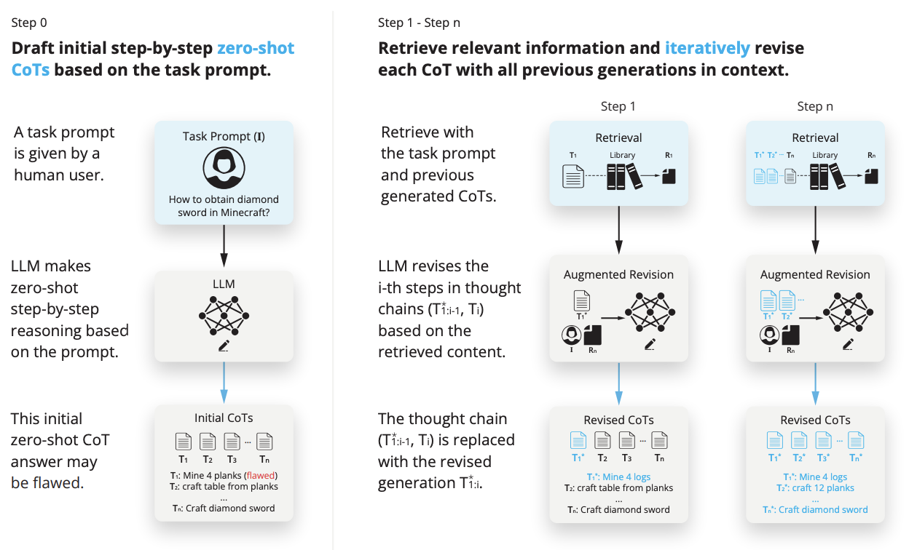
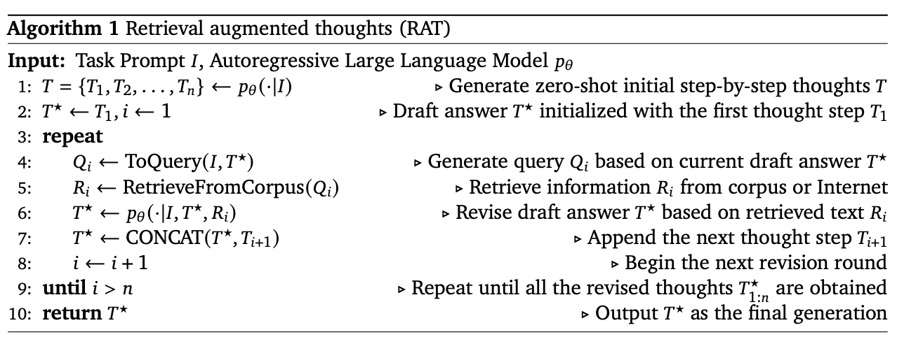

# [Large Multimodal Agents: A Survey](https://arxiv.org/pdf/2402.15116.pdf)
簡易まとめ：自分の言葉でまとめたもの。  
GPT翻訳：GPTで翻訳した全文。  

# 簡易まとめ
## abstract
外部情報の検索を用いた、思考連鎖の反復的な改良が、大規模言語モデルでの長期生成タスクの推論と生成能力を大幅に向上させるが、幻覚の発生が課題である。  
提案するRATでは、ゼロショットで生成したCoTを、タスククエリや現在および過去の思考ステップに関連する情報用いて、一つ一つの思考ステップを改訂できる。  
RATをGPT-3.5、GPT-4、そしてCodeLLaMA-7bに適応することで、  
コード生成で平均13.63％、数学的推論で16.96％、創造的なライティングで19.2％、身体的タスク計画で42.78％の評価スコアが相対的に増加した。デモは[ここ](https://craftjarvis.github.io/RAT)。  

## 1. introduction
LLMは、様々な自然言語推論タスクにおいて大きな進歩を遂げている。  
特に、高度なプロンプト戦略、思考の連鎖（CoT）プロンプトを組み合わせた場合に上手くいっている。  
同時に、LLMの推論の正確性について課題感も増えている。  
具体的には、モデルの応答や中間推論パス(CoTの連鎖中)における幻覚である。  
この課題は、ゼロショットCoTプロンプト(ステップ・バイ・ステップで考えよう)や、複数ステップでの処理や、文脈認識推論が必要な長期生成タスクで重要である。  

この課題に対し、様々なプロンプト技術が提案されている。  
有望なのはRAGで、RAGでは外部データを取得して、より事実に基づいた推論を可能にする。  
本論では、このRAGを高度な長期推論とどのように利用すると良いかを探求する。  
筆者らは、中間推論時の幻覚は、外部の知識の利用により軽減できると考えている。  
図1に本論の手法のイメージを示す。  

図1: RATパイプライン  

step0(図1の左)の流れは、ユーザーが質問を生成・LLMが回答のためのタスクをゼロショットで分解・分解したタスクを順番づけて実行する。  
step1~n(図1の右)の流れは、step0で生成されたnステップの回数、実施される。  
■ step1の流れ  
【Retrieval】Cotで作られた最初のタスクT1を用いて、関連する情報R1が検索される。  
【Augmented Revision】I(元のユーザープロンプト)と、R1(関連情報)を使って $T_1^\*$ を生成する。  
【Revised CoTs】 $T_1^\*$ と元のCoTを組み合わせて、新しいCoTを生成する。  
■ stepNの流れ
【Retrieval】改良した $T_1^\*$ ~ $T_{n-1}^\*$ と $T_n$ を用いて、関連する情報 $R_n$ を検索する。  
【Augmented Revision】改良した $T_1^\*$ ~ $T_{n-1}^\*$ と、I(元のユーザープロンプト)と、 $R_n$ (関連情報)を使って $T_n^\*$ を生成する。  
【Revised CoTs】 $T_1^\*$ ~ $T_{n}^\*$ で新しいCoTを生成する。  

※ Augmented Revisionのstep1で、 $T_1^\*$ が入力になっているように見えるけど、多分ミスだと思う。  
n-1までの $T_{n-1}^\*$ が入力になるはず。なぜなら、Revisionが目的なのに、 $T_1^\*$ が分かっているならこれをする必要がないから。  

上記の戦略は、2つの主要なアイデアで成り立つ。  
1. LLMによって生成されたゼロショットCoTと大元のタスクプロンプトから、CoTを改訂するのに役立つ情報を取得する。  
2. タスクプロンプトを修正し、過去ステップと現在ステップの情報で、現在のタスクステップを改訂する。  

これは、タスク実行中に、長いステップを踏む必要があるが、その各ステップ中に外部知識を活用することで、精度を上げる行為であり、人間の段階的な思考ステップに似ている。  
図2に、RATと他の手法の比較を示す。  

図2: 様々なLLMでの回答生成の比較  

赤がハルシネーションで、緑が正しい文章。  
RATやRAGはハルシネーションに強く、RATはRAGよりも良い。  
コード生成、数学的推論、身体的タスク計画、創造的ライティングの長期タスクに適用して評価した。  
利用したLLMモデルは、GPT-3.5、GPT-4、CodeLLaMA7b。  

結果はそれぞれ以下。  

| タスク    | 種類         | 評価結果      |
|--------|------------|-----------|
| コード生成  | HumanEval  | +20.94%   | 
| コード生成  | HumanEval+ | +18.89%   |
| コード生成  | MBPP       | +14.83%   |
| コード生成  | MBPP+      | （+1.86%）  |
| 数学的推論  | GSM8K      | （+8.36%）  |
| 数学的推論  | GSMHard    | （+31.37%） |
| Minecraftタスク計画  | none       | 実行可能性で2.96倍、妥当性で+51.94% |
| 創造的ライティング  | none       | +19.19% |

また、ablation study(あえて機能を削除し、有効性を確認する方法)により、1) RAGを使用したCoTの改訂と、2)進行的な改訂および生成が果たす重要性を確認する。  
本論では、人間が行うように、外部の知識の助けを借りて、LLMがゼロショット方式で推論プロセスをどのように改訂するかを明らかにする。

## 2. Retrieval Augmented Thoughts(RAT)
本論は、長期的な推論と生成を、ハルシネーションを軽減して実現することが目標。  
この実現のため、二つの要素が重要である。  
1) 事実の情報へのアクセスの容易さ  
2) サブタスクへの分解  

しかし、以下の課題が残る。  
1) どの事実情報を用いるべきか？
2) 事実情報を用いてサブタスクをどのように修正するか？  
この課題にアプローチするために、まずRAGとCoTの説明をする。  

### 2-1. Preliminary
#### Retrieval-Augmented Generation(RAG）
RAGは、信頼できる情報源から抽出した関連テキストをLLMに提供することで、ハルシネーションに対応する。  
主に、質問応答（QA）タスクで使用される。  
具体的には、𝑛個の候補文書の集合 $𝑅 := \lbrace 𝑅_𝑖 \rbrace _{i=1}^n$ に対して、クエリ $𝑄$ に関する最も適切な文書を取得するタスクである。  
クエリ $𝑄$ は、質問/タスクのプロンプト自体や、LLMによって生成された関連情報である。  
これを実現するためにまず、文書のセマンティックに意識した埋め込み $𝑟_𝑖 := emb(𝑅_𝑖) ∈ \mathbb{R}^𝐾$ （𝐾は埋め込みのサイズ）と  
クエリの埋め込み $𝑞 := emb(𝑄) ∈ \mathbb{R}^𝐾$ を抽出します。  
emb(·)は、Sentence-BERTなど埋め込みベクトル作成モデルで実装する。  
クエリと文書の関連性は、コサイン類似度で計算する。  

$$
sim(Q, R_i) = \frac{q \cdot r_i}{\| q \| \| r_i \|}
$$

これで計算された、トップ𝑘個の文書がLLMのプロンプトに供給され、最終的な答えを生成する。  
これにより、RAGはLLMの幻覚を軽減する。  
しかし、複雑な推論タスクは、効果的な検索クエリの作成が困難であり、関連文書を見つけづらく、RAGの適用性を低下させる。  
従来のRAGは、一度にすべての関連情報を取得するが、長期推論においては、後続の推論や生成ステップで必要な情報が何であるかを予測することが困難である。  

#### Chain of Thoughts（CoT）
Chain of Thoughts(CoT）は、複雑な推論ステップを必要とするタスクの下でのLLMのパフォーマンスを向上させるように設計されている。  
具体的には、LLMに直接正解を生成させる代わりに、LLMに中間推論ステップ（思考）を最初に出力させ、それらを最終回答に要約させるようにする。  
これは、ゼロショットでCoT推論を奨励するプロンプトテクニック（例えば「ステップバイステップで考えよう」）を用いるか、  
類似のタスクでCoTを実行するfew-shotによって実施される。  
しかし、生成された中間思考に直接的な監視がなされていないため、LLMは関連するドメイン知識が欠けていたり、幻覚によって過ちを犯す可能性がある。  

### 2.2. Our Approach
CoTとRAGの課題の解決は、CoTによって生成された各思考ステップをRAGで修正することである。  
図1に、この概要を示す。  
またアルゴリズム1で、処理の流れを示す。  

アルゴリズム1: RATの簡易アルゴリズム  

アルゴリズム1の具体的な流れは以下。  
入力は、大元のプロンプト $I$ とLLM $p_θ$。  
1行目: $p_θ$ を用いて、ゼロショットでCoT $𝑇 := \lbrace 𝑇_𝑖 \rbrace _{i=1}^n$ を生成。  
2行目: 初期値として、 $𝑇^\* = T_1 i=1$ をセット。  
3行目: CoTのN個のループ開始。  
4行目: $I$ と $T^\*$ を用いて、クエリ $Q_i$ を生成。  
5行目: クエリ $Q_i$ を用いてRAGで関連情報 $R_i$ を取得。  
6行目: $I$ と $T^\*$ と $R_i$ を $p_θ$ に入力し、 $T^\*$ を更新。  
7行目: $T^\*$ を $T^\*$ と $T_{i+1}$ を結合して更新。  
8行目: iをインクリメント。  
9行目: iがNを超えたら終了。  
10行目: 最終的な $T^\*$ を返却。  

#### 4行目
CoTで作られる各Tはハルシネーションである可能性があるため、生成された各思考ステップをRAGで修正する。  
具体的には、以前の思考ステップを固定したと仮定して、 $𝑇_{1:𝑖}$ を修正することになった場合、  
テキスト $\lbrace I, 𝑇_1, . . . , 𝑇_𝑖 \rbrace $をクエリ $𝑄_𝑖$ に変換します。  

$$
𝑄_𝑖 = ToQuery(I, 𝑇_1, . . . , 𝑇_𝑖)  
$$  

ここで $ToQuery(·)$ はsentence transformerなどのテキストエンコーダか、  
$I$ と、現在および過去の思考ステップ $𝑇_1, . . . , 𝑇_𝑖$ をクエリ $𝑄_𝑖$ に変換できるLLMのいずれかである。  

#### 5行目
このクエリ $𝑄_𝑖$ をRAGに入力し、関連文書 $𝑅_𝑖$ を取得する。  

#### 6,7行目
そして、この関連文書 $𝑅_𝑖$ をプロンプトに追加して修正された思考ステップ $𝑇_𝑖^*$ を生成する。  

$$
𝑇_{1:𝑖}^\* = 𝑝𝜃(·|I, 𝑇_1, . . . , 𝑇_𝑖, 𝑅_𝑖)
$$

最終的に、実際のタスクに応じて、修正された $𝑇_{1:𝑛}^\*$ は、そのまま最終モデルの応答として使用されることもある。  
コード生成や創造的ライティングでは、LLMにさらにプロンプトを与え、各修正された思考ステップから完全な応答をステップバイステップで生成する。  
$𝑇_𝑖$ の思考ステップを修正する際、現在のステップ $𝑇_𝑖$ のみを使用するのではなく、完全な思考の連鎖 $𝑇_1, . . . , 𝑇_𝑛$ を使って  
RAGのためのクエリを生成するのではなく、  
現在の思考ステップ𝑇𝑖とそれまでの修正された思考ステップ $𝑇_{1:i−1}^\*$ からクエリ $𝑄_𝑖$ を生成するのが特徴的である。  
つまり、RAGを使用してCoTを修正する際は、因果的な推論をしていることとなる。  

$$
𝑄_𝑖 = ToQuery(𝐼, 𝑇_{1:𝑖−1}^\*, 𝑇𝑖)
$$

$$
𝑇_{1:𝑖}^\* = 𝑝𝜃(·|𝐼, 𝑇_{1:𝑖−1}^\*, 𝑇_𝑖, 𝑅_𝑖)
$$

過去のTを継続して利用することで、さまざまな参考文献を継続的に参照することとなり、  
各推論ステップが最も正確で関連性の高い情報によって導かれることを実現し、生成される出力の品質と信頼性を高めている。  

２つの課題、1) RAGだけだと長期的なタスクへの対応が困難である、2)CoTだけだとハルシネーションに弱い」へのアプローチは、  
1. CoTの推論ステップを可視化可能。  
2. CoTの各推論ステップでRAGを用いて、情報を取得可能。  
3. CoTの各推論ステップを過去の結果を用いながら修正可能。  

1.は、各推論ステップでどんなタスクが実行されたかが確認でき、修正が容易であることを示している。  
2.は、最終的な回答をRAGで直接参照できなくても、各推論ステップごとに参照して最終的な回答を導き出せることを示している。  
3.は、CoT全体を修正するのではなく、各推論ステップを修正することで、より信頼性が高まることを示している。  

## 3. Experiments
RATを、多様なベンチマークでテストした。  

### 3.1. Experimental Setups
4つベンチマークデータを評価に採用した。  

#### 1) コード生成
HumanEval、HumanEval+、MBPP、MBPP+。  
これらは、単純な関数の実装から、複雑なアルゴリズムの課題まで、幅広いプログラミング問題を網羅している。  

#### 2) 数学的推論
GSM8K、GSM-HARDデータセットを用いた。  
これらは数千のマルチステップの数学問題が含まれる。  

#### 3) 創造的ライティング
RATの多用な途性を評価するために用い、調査や要約などを含んだオープンエンドのテキスト生成のさまざまな側面を評価できる。  

#### 4) 身体的計画タスク
Minecraftのオープンエンド環境で評価する。  
簡単な目標から、挑戦的なダイヤモンド目標までの100個のタスクセットを用いてMCTextWorldで評価する。  

#### 評価指標
コード生成:合格率pass@kが評価指標(𝑘はサンプリング数)。  
数学的推論タスク:各問題の正確さを計算し、GSM8Kの指標で評価する。  
身体的計画タスク:MC-TextWorldの計画実行成功率を実行可能性として評価する。  
身体的計画（妥当性として）と創造的ライティングタスク:人間のELOレーティングも評価する。  
上記は全て、数値が高いほど良い。  

#### ベースライン
ベースラインには、元の言語モデル（DIRECTとして参照）や、𝑛回の検索例を用いたRAGが含まれる。  
これは、シングルショット（1 shot）とマルチショット（5 shots）で実施している。  
さらに、ゼロショットCoT（CoT）アプローチもステップバイステップの推論プロセスとの比較として、比較対象とした。  
基本的に、同じ言語モデルをベースモデルとして利用している。  
また、公平な比較を保証するために、どの方法もベンチマークからの例をインコンテキスト学習として使用しない。  

[TODO] ここから

#### RAGの設定
RATは、言語モデルのパフォーマンスを向上させるために外部知識源を統合するリトリーバル拡張生成手法の能力を活用しています。  
具体的には、コード生成や数学的推論タスクにおいて、codeparrot/github-jupyterデータセットを主要な検索ベクトルライブラリとして使用しました。  
Minecraftでの身体的計画タスクには、Minecraft Wiki1とDigMinecraft2ウェブサイトを情報源としてLLMに利用可能にしました。  
オープンエンドの創造的ライティングタスクでは、インターネット上でクエリを検索するためにGoogleを使用しました。  
すべての埋め込み計算にはOpenAIのtext-embedding-ada-002 APIサービスを使用しました。  

ベンチマーク汚染のリスク（コードライブラリが評価されている問題の正確な解決策を含んでいる可能性のある問題）を認識し、  
Guo et al.（2024）によって説明された厳格な前処理方法論を採用しました。  
ベンチマーク汚染の潜在的な影響と、私たちの前処理戦略の効果については、付録Dで詳細に議論されています。  

### 3.2. Results
表1に示されたコード生成の結果と、表2に示された他のベンチマークの結果から、RATが複数のベンチマークにわたって包括的な評価を受けていることが示されています。  
RATは、ほとんどのベンチマークと指標において他の方法を一貫して上回り、長期的なコンテキストを生成する優れた能力を示しています。  
特に、コード生成のHumanEvalおよびHumanEval+ベンチマークにおいて、RATはpass@1とpass@5のレートで顕著な改善を達成し、  
初回試行の正確性とトップ5試行内の顕著な向上を示しています。  
例えば、HumanEvalベンチマークでは、RATはベースモデルのパフォーマンスに対して最大20.94%のpass@1の向上と、最大25.68%のpass@5の向上を実現しています。  
この傾向は異なる基礎ベースモデルにわたって観察され、初期モデルの能力にかかわらずRATの効果を強調しています。  
数学的推論タスクにおいて、RATはGSM8Kで8.37%、GSMHardで顕著な31.37%の精度向上を示し、GPT-3.5モデルで展開した際には平均18.44%の全体的な改善を達成しました。  
また、Minecraftのオープンエンドの身体的計画タスクにおいて、RATは他の全ての方法を大きく上回り、実行可能性で76.67±8.02%、妥当性で人間評価スコア29.37を達成し、  
複雑なオープンワールド環境で実行可能で文脈に適した計画を生成する優れた能力を示しました。  
RATの優れたパフォーマンスは、幅広い創造的ライティングタスクにおいても保持されています。  
多様なシナリオで高品質なコンテンツを生成する能力が示され、オープンエンドのシナリオでLLMの一般的な創造的ライティング能力を向上させる強力なツールとしての可能性が強調されました。  
これらのタスクは極めて多様であり、RATはすべてのベースラインに対して一貫した改善を達成しています。  
これらの結果は、進化する推論思考に基づいて検索クエリの反復的な改良を活用するRATのアプローチの利点を強調しています。  
この戦略は、取得された情報の関連性と品質を向上させるだけでなく、生成されたコンテキストの正確性と効率を大幅に改善します。 

# GPT翻訳
## abstract
「情報検索を用いた思考連鎖の反復的な改訂が、長期生成タスクにおける大規模言語モデルの推論と生成能力を大幅に向上させる一方で、幻覚の発生を大幅に軽減することを探求します。  
特に、提案された方法であるリトリーバル拡張思考（RAT）は、ゼロショットCoTが生成された後、タスククエリ、現在および過去の思考ステップに関連する情報を検索して、  
一つ一つの思考ステップを改訂します。  
RATをGPT-3.5、GPT-4、そしてCodeLLaMA-7bに適用することで、これらのモデルの長期生成タスクにおけるパフォーマンスが顕著に向上し、  
コード生成で平均13.63％、数学的推論で16.96％、創造的なライティングで19.2％、身体的タスク計画で42.78％の評価スコアが相対的に増加しました。  
デモページは https://craftjarvis.github.io/RAT で見ることができます。  

## 1. introduction
大規模言語モデル（LLM）は、様々な自然言語推論タスクにおいて実り多い進歩を遂げています、特に大規模モデルと高度なプロンプト戦略、  
特に思考の連鎖（CoT）プロンプトを組み合わせた場合です。  
しかし、LLMの推論の事実的な正確性についての懸念が増えています。  
これは、モデルの応答や中間推論パス、すなわちCoTにおける可能な幻覚を引用しています。  
この問題は、ゼロショットCoTプロンプト、いわゆる「ステップ・バイ・ステップで考えよう」や、  
複数ステップおよび文脈認識推論が必要な長期生成タスク（コード生成、タスク計画、数学的推論など）においてさらに重要になります。  
事実上有効な中間思考は、これらのタスクの成功完了には重要です。  

この問題を軽減するために、いくつかのプロンプト技術が提案されています。  
その中で有望な方向性であるリトリーバル拡張生成（RAG）は、人間の推論からの洞察を求め、より事実に基づいた推論を促進するために取得した情報を活用します。  
本論文では、RAGを高度な長期推論とどのように相乗効果を発揮させるかを探求します。  
私たちの直感では、中間推論過程内の幻覚は外部の知識の助けによって軽減される可能性があります。  
結果として提示されるプロンプト戦略、リトリーバル拡張思考（RAT）は図1で示されています。  

図1: RATパイプライン  

私たちの戦略は2つの主要なアイデアを含みます。  
まず、LLMによって生成された初期のゼロショットCoTと元のタスクプロンプトを使用して、おそらく欠陥のあるCoTを改訂するのに役立つ情報を取得します。  
次に、CoT全体を取得して一度に最終的な応答を生成するのではなく、LLMがCoT（一連のサブタスク）に従ってステップバイステップで応答を生成し、  
現在の思考ステップのみがタスクプロンプト、現在および過去のCoTで取得した情報に基づいて改訂される段階的なアプローチを考案します。  
この戦略は、複雑な長期問題解決中に外部知識を活用して段階的に思考を調整する人間の推論プロセスに例えることができます。  
RATとその対象との比較は図2で見ることができます。  

図2: 様々なLLMでの回答生成の比較  

RATを、コード生成、数学的推論、身体的タスク計画、創造的ライティングを含む幅広い困難な長期タスクに適用して評価しました。  
さまざまな規模の複数のLLMを使用します：GPT-3.5、GPT-4、CodeLLaMA7b。  
結果は、これらのLLMにRATを組み合わせることが、標準のCoTプロンプトやRAGアプローチよりも大きな利点をもたらすことを示しています。  
特に、私たちが選択したタスク群全体で新たな最先端のパフォーマンスレベルを観察します：  
1) コード生成では、HumanEval（+20.94%）、HumanEval+（+18.89%）、MBPP（+14.83%）、MBPP+（+1.86%)
2) 数学的推論問題では、GSM8K（+8.36%）、GSMHard（+31.37%）
3) Minecraftタスク計画（実行可能性で2.96倍、妥当性で+51.94%）
4) 創造的ライティング（人間のスコアで+19.19%）

追加の削除研究は、RATの二つの主要な要素、すなわちRAGを使用したCoTの改訂と進行的な改訂および生成が果たす重要な役割をさらに確認します。  
この研究は、人間が行うように、外部の知識の助けを借りて、LLMがゼロショット方式で推論プロセスをどのように改訂するかを明らかにしています。  

## 2. Retrieval Augmented Thoughts
LLMを使用する際に、長期的な推論と生成をサポートし、幻覚を軽減することが私たちの目標です。  
長期的なタスクに満足のいくパフォーマンスを得るためには、二つの要素が不可欠です。  
まず、事実情報へのアクセスは、検索によって容易にされることができます。  
次に、複雑なタスクを完了するためのスクラッチパッドを概説する適切な中間ステップは、CoTによって容易にされることができます。  
しかし、これら二つを単純に組み合わせるだけでは必ずしも改善につながるわけではありません。  
依然として二つの疑問が残ります：(1) どのような情報が検索に関連するか、(2) 関連する事実情報を用いて推論ステップをどのように効果的に修正するか。  
この二つの疑問にどのように対処できるかをより深く理解するために、まずRAGとCoTの簡単な導入を提供します。  

### 2-1. Preliminary
#### Retrieval-Augmented Generation(RAG）
RAGは、信頼できる情報源から抽出された関連テキストを大規模言語モデル（LLM）に提供することで、架空の事実を生成する問題に対処します。  
これは主に、質問応答（QA）タスクで使用されます。  
具体的には、𝑛個の候補文書の集合 $𝑅 := \lbrace 𝑅_𝑖 \rbrace _{i=1}^n$ に対して、クエリ𝑄に関連する最も適切な文書を取得することを目指しています。  
クエリ𝑄は、質問/タスクのプロンプト自体またはLLMによって生成された関連情報です。  
これを実現するために、RAGはまず、文書のセマンティックに意識した埋め込み $𝑟_𝑖 := emb(𝑅_𝑖) ∈ \mathbb{R}^𝐾$ （𝐾は埋め込みのサイズ）とクエリの埋め込み $𝑞 := emb(𝑄) ∈ \mathbb{R}^𝐾$ を抽出します。  
emb(·)は、Sentence-BERTなどの様々なテキスト埋め込みモデルで実装することができます。  
クエリと文書の関連性は、それらのコサイン類似度によって測定されます：  

$$
sim(Q, R_i) = \frac{q \cdot r_i}{\| q \| \| r_i \|}
$$

その関連性に基づいて、トップランクの𝑘個の文書がLLMのプロンプトに供給され、最終的な答えを生成します。  
このような豊かで事実に基づいた文脈によって、RAGはLLMの幻覚を軽減します。  
しかし、複雑な推論タスク（例えば、複数ステップの推論が必要なタスク）は、効果的な検索クエリに翻訳することが困難であり、関連文書を見つけることへの課題を生じさせ、RAGの適用性を低下させます。  
従来のRAGは、一度にすべての関連情報を取得します。  
しかしながら、それは後続の推論や生成ステップで必要な「事実」や情報が何であるかを予測することが困難である事実を見過ごしています。  
タスクのプロンプト自体では、これに対する十分な手がかりを提供するのにほとんど役立ちません。  

#### Chain of Thoughts（CoT）
思考の連鎖（Chain of Thoughts, CoT）プロンプトは、複雑な推論ステップを必要とするタスクの下での大規模言語モデル（LLM）のパフォーマンスを向上させるように設計されています。  
これには、複数ステップの数学的言語問題などが含まれます。  
具体的には、LLMに直接正解を生成させる代わりに、CoTプロンプトはLLMに、タスクのためのスクラッチスペースとして機能する中間推論ステップ、  
すなわち思考を最初に出力させ、その後それらを最終回答に要約させるよう促します。  
このようなLLMの振る舞いは、ゼロショットでCoT推論を奨励する用語（例えば「ステップバイステップで考えよう」）によって刺激されるか、  
類似のタスクでCoTを実行する数ショットの例によって引き起こされることがあります。  
しかしながら、中間思考に直接的な監視がなされていないため、LLMは関連するドメイン知識が欠けているためだったり、幻覚によって偏っているためにエラーを犯す可能性があります。  

### 2.2. Our Approach
前述のCoTプロンプトとRAGの問題を緩和するための直感は、CoTプロンプトによって生成された各思考ステップをRAGで修正することを適用することです。  
概要は図1およびアルゴリズム1で見ることができます。  

アルゴリズム1: RATの簡易アルゴリズム  

具体的には、タスクプロンプトIを与えた後、まずLLMにゼロショットでステップバイステップの思考（「ステップバイステップで考えよう」)  
$𝑇 := \lbrace 𝑇_𝑖 \rbrace _{i=1}^n$ を生成させます。  
ここで $𝑇_i$ はi番目の思考ステップを表します。  
長期生成タスクでは、𝑇はコード生成の疑似コードとコメント、創造的ライティングの記事の概要など、中間推論ステップであるか、  
または図1に示されるような身体的タスク計画のサブゴールのリストなどのドラフト応答そのものであるかのどちらかです。  

𝑇が不完全である可能性がある（例えば、幻覚を含む）ため、最終応答を生成する前に、生成された各思考ステップをRAGで修正します。  
具体的には、以前の思考ステップを固定したと仮定して、 $𝑇_{1:𝑖}$ を修正することになった場合、  
テキスト $\lbrace I, 𝑇_1, . . . , 𝑇_𝑖 \rbrace $をクエリ $𝑄_𝑖$ に変換します。  

$$
𝑄_𝑖 = ToQuery(I, 𝑇_1, . . . , 𝑇_𝑖)  
$$  

ここで $ToQuery(·)$ はテキストエンコーダまたはタスクプロンプト $I$ 、現在および過去の思考ステップ $𝑇_1, . . . , 𝑇_𝑖$ をクエリ $𝑄_𝑖$ に変換できるLLMのいずれかです。  
RAGを採用して、クエリ $𝑄_𝑖$ を使用して関連文書 $𝑅_𝑖$ を取得し、それをプロンプトに追加して修正された思考ステップ $𝑇_𝑖^*$ を生成します。  

$$
𝑇_{1:𝑖}^* = 𝑝𝜃(·|I, 𝑇_1, . . . , 𝑇_𝑖, 𝑅_𝑖)
$$

最終的に、実際のタスクに応じて、修正された思考ステップ $𝑇_{1:𝑛}^\*$ は、例えば身体的タスク計画など、そのまま最終モデル応答として使用されることもあります。  
コード生成や創造的ライティングのようなタスクでは、LLMにさらにプロンプトを与えて、各修正された思考ステップから完全な応答（コード、文章）をステップバイステップで生成させます。  
$𝑇_𝑖$ の思考ステップを修正する際、現在のステップ $𝑇_𝑖$ のみを使用するのではなく、完全な思考の連鎖 $𝑇_1, . . . , 𝑇_𝑛$ を使ってRAGのためのクエリを生成するのではなく、  
現在の思考ステップ𝑇𝑖とそれまでの修正された思考ステップ $𝑇_{1:i−1}^\*$ からクエリ $𝑄_𝑖$ を生成することを確認します。  
つまり、RAGを使用して思考を修正する際には因果的な推論を採用します。  

$$
𝑄_𝑖 = ToQuery(𝐼, 𝑇_{1:𝑖−1}^\*, 𝑇𝑖)
$$

$$
𝑇_{1:𝑖}^\* = 𝑝𝜃(·|𝐼, 𝑇_{1:𝑖−1}^\*, 𝑇_𝑖, 𝑅_𝑖)
$$

この方法は、さまざまな参考文献を継続的に参照することで元の思考𝑇のエラーを修正し、  
各推論ステップが最も正確で関連性の高い情報によって導かれることを保証し、生成される出力の品質と信頼性を大幅に向上させます。  
本手法が冒頭で述べた二つの問題に対処できる理由についての仮説は以下の通りです。  
まず、複雑な推論で使用される情報を知る最も直接的な方法は、推論ステップを「見る」ことです。  
私たちのアプローチは、生成された思考全てとタスクプロンプトを利用して、より効果的な検索のための手がかりをより多く提供します。  
次に、特に難しい複雑な問題に対する最終回答に関連する情報は、直接検索できないことがあります。  
その代わり、仮定される簡単な中間の質問に関連する情報の検索がより容易です。  
多くの推論タスクの合成的な性質のおかげで、反復的な検索プロセスもより効果的かもしれません。  
第三に、潜在的な幻覚の修正はターゲットを絞る必要があります。  
完全なCoTをRAGで修正すると、そうでなければ正しいステップでエラーを導入する可能性があります。  
ステップごとに一つずつ修正する方がより信頼性があります。  
最初の二点は質問(1)に対応し、最後の点は質問(2)に対応します。  
定量的な証拠は、小節3.4の削除研究で見ることができます。  

## 3. Experiments
我々は提案手法であるRATを、長期的な生成と推論を強調する多様なベンチマークでテストしました。  
従来の方法では、これらのベンチマークで一般的に苦戦しており、LLMの出力には「幻覚」とされるステップが明らかに存在します。  
これらのステップは、元のクエリに沿っていないか、明らかに無効です。  
より詳細な議論については、3.3節（事例分析）をご参照ください。  
スペースの制約上、各ベンチマークの設定を紹介したり、各ベンチマークでの結果を詳細に議論することはありません。  
むしろ、このセクションでは、我々の方法のパフォーマンスを包括的に示し、  
我々の方法がどのように機能し、いつ機能しないのかについての予備的な実証分析のためのスポットライトを提供します。

### 3.1. Experimental Setups
我々は四つのグループのベンチマークを採用しています。  

#### コード生成
HumanEval、HumanEval+、MBPP、そしてMBPP+が含まれます。  
これらのベンチマークは、単純な関数実装からより複雑なアルゴリズムの課題まで、幅広いプログラミング問題を網羅しており、生成能力を評価するための堅牢なテストベッドを提供します。  

#### 数学的推論
GSM8KおよびGSM-HARDデータセットで行われ、これらは数千のマルチステップ数学問題を含んでいます。  

#### 創造的ライティング
RATの多用途性を評価するために実施され、調査や要約などを含み、オープンエンドのテキスト生成のさまざまな側面を強調しています。  

#### 身体的計画タスク
Minecraftのオープンエンド環境で評価されます。  
簡単な目標から挑戦的なダイヤモンド目標までの100のタスクセットがMCTextWorldを通じて評価されます。  

#### 評価指標
コード生成には、古典的な合格率pass@kが評価指標として選ばれます、ここで𝑘はサンプリング数を示します。  
数学的推論タスクでは、各問題の正確さを計算し、GSM8Kで確立された指標に沿って評価します。  
身体的計画タスクでは、MC-TextWorldの計画実行成功率を実行可能性として計算します。  
また、身体的計画（妥当性として）および創造的ライティングタスクに対する真のスキル評価スコアを計算するために、人間のELOレーティング評価も実施します。  
これらの指標は、数値が高いほど良いとされます。  

#### ベースライン
包括的で公平な比較環境を確立するため、いくつかの基本的な方法を組み込みました。  
私たちのベースラインには、元の言語モデル（DIRECTとして参照）や、𝑛回の検索例を用いたリトリーバル拡張生成（RAG）手法が含まれています。  
これは、シングルショット（1 shot）とマルチショット（5 shots）の構成で、Lewis et al.（2020b）によって文書化されています。  
さらに、Kojima et al.（2022）によって概念化されたゼロショットCoT（CoT）アプローチも検討しています。  
これは、デモンストレーションがゼロの下で複雑な問題解決タスクを促進するために、ステップバイステップの推論プロセスをシミュレートします。  
異なる方法に対しては、同じ言語モデルがベースモデルとして使用されます。  
公平な比較を保証するために、どの方法もベンチマークからの例をインコンテキスト学習のデモンストレーションとして使用していません。  

#### RAGの設定
RATは、言語モデルのパフォーマンスを向上させるために外部知識源を統合するリトリーバル拡張生成手法の能力を活用しています。  
具体的には、コード生成や数学的推論タスクにおいて、codeparrot/github-jupyterデータセットを主要な検索ベクトルライブラリとして使用しました。  
Minecraftでの身体的計画タスクには、Minecraft Wiki1とDigMinecraft2ウェブサイトを情報源としてLLMに利用可能にしました。  
オープンエンドの創造的ライティングタスクでは、インターネット上でクエリを検索するためにGoogleを使用しました。  
すべての埋め込み計算にはOpenAIのtext-embedding-ada-002 APIサービスを使用しました。  

ベンチマーク汚染のリスク（コードライブラリが評価されている問題の正確な解決策を含んでいる可能性のある問題）を認識し、  
Guo et al.（2024）によって説明された厳格な前処理方法論を採用しました。  
ベンチマーク汚染の潜在的な影響と、私たちの前処理戦略の効果については、付録Dで詳細に議論されています。  

### 3.2. Results
表1に示されたコード生成の結果と、表2に示された他のベンチマークの結果から、RATが複数のベンチマークにわたって包括的な評価を受けていることが示されています。  
RATは、ほとんどのベンチマークと指標において他の方法を一貫して上回り、長期的なコンテキストを生成する優れた能力を示しています。  
特に、コード生成のHumanEvalおよびHumanEval+ベンチマークにおいて、RATはpass@1とpass@5のレートで顕著な改善を達成し、  
初回試行の正確性とトップ5試行内の顕著な向上を示しています。  
例えば、HumanEvalベンチマークでは、RATはベースモデルのパフォーマンスに対して最大20.94%のpass@1の向上と、最大25.68%のpass@5の向上を実現しています。  
この傾向は異なる基礎ベースモデルにわたって観察され、初期モデルの能力にかかわらずRATの効果を強調しています。  
数学的推論タスクにおいて、RATはGSM8Kで8.37%、GSMHardで顕著な31.37%の精度向上を示し、GPT-3.5モデルで展開した際には平均18.44%の全体的な改善を達成しました。  
また、Minecraftのオープンエンドの身体的計画タスクにおいて、RATは他の全ての方法を大きく上回り、実行可能性で76.67±8.02%、妥当性で人間評価スコア29.37を達成し、  
複雑なオープンワールド環境で実行可能で文脈に適した計画を生成する優れた能力を示しました。  
RATの優れたパフォーマンスは、幅広い創造的ライティングタスクにおいても保持されています。  
多様なシナリオで高品質なコンテンツを生成する能力が示され、オープンエンドのシナリオでLLMの一般的な創造的ライティング能力を向上させる強力なツールとしての可能性が強調されました。  
これらのタスクは極めて多様であり、RATはすべてのベースラインに対して一貫した改善を達成しています。  
これらの結果は、進化する推論思考に基づいて検索クエリの反復的な改良を活用するRATのアプローチの利点を強調しています。  
この戦略は、取得された情報の関連性と品質を向上させるだけでなく、生成されたコンテキストの正確性と効率を大幅に改善します。  

### 3.3. Case Analysis
ここでは、身体的計画タスクと創造的ライティングタスクをケース分析として取り上げます。
多文書の質問応答タスクに類似した方法で、Minecraftにおける長期計画のタスクは知識が密集しており、  
各タスクの完了にはさまざまなアイテムの考慮が必要です。  
しかし、インターネット上のオープンワールドMinecraftの知識は断片化されており、タスクの完了はしばしば複数の情報源からの情報に依存しています。  
私たちは、ChatGPTのような言語モデルがゼロショットCoT推論を通じて必要なアイテムを特定できる一方で、手順の誤りが一般的であることを観察しました。  
たとえば、ChatGPTは作業台の材料を4つの木のブロックと誤って特定しました（正しい答えは4つの板です）、これはCoTプランの実行可能性の信頼性が低いことを示しています。  
古典的なRAGアルゴリズムは、質問をクエリとして知識を取得し、最終的なターゲットアイテムに焦点を当てますが、中間アイテムを不適切に取得し、タスクの改善にはほとんど貢献しません。  
対照的に、RATは継続的に思考をターゲットの検索で洗練することでCoTの初期回答を改善し、タスクの進行と関連するアイテム知識と密接に一致させます。  
この方法論は、計画に関与するすべてのアイテムの包括的な理解と取得を確実にすることで、計画効果を著しく高め、  
Minecraftの長期計画の課題に対処するための構造化された推論と動的な知識取得とのシナジーを強調しています。

オープンエンドの創造的ライティングタスクに取り組む際、LMの生成物の評価は通常、完全性と正確性に焦点を当てています。  
例えば「アメリカ南北戦争をタイムラインに沿って要約する」というタスクでは、DIRECTとCoTプロンプトの下でのLMはしばしば重大な幻覚を生産します。  
例として、「南北戦争は公式には1860年4月12日に南カロライナ州で連合国軍がフォートサムターを攻撃したときに始まった」という声明には間違った情報が含まれています。  
実際には1861年が正しい年であるにもかかわらず、誤って1860年が言及されています。  

このタスクに対するインターネットへの直接的なクエリは、しばしば限定的なイベントを取得し、戦争の正確な開始日である1861年4月12日を見落とすことが多いです。  
さらに、検索から取得したコンテンツを要約する傾向があるRAGアプローチは、RAG-1でもRAG-5でも、このイベントを回答でしばしば見落とします。  
一方、RATは言語モデルのドラフト回答に基づいて検索を行い、通常は特定の日付などの詳細で幻覚が発生することがありますが、  
これは検索エンジンが「アメリカ南北戦争の開始日」といった関連情報を特定するのを妨げません。  
RATは取得したコンテンツを利用してドラフト回答の誤りを特定し、修正するために使用し、単に取得したコンテンツを要約するのではありません。  
したがって、RATは推論を通じて完全な生成を達成し、取得した知識を活用することで回答の正確性と信頼性を向上させることができます。  
実験結果はRATの効果を検証しています。  

### 3.4. Ablation Study
#### Ablation on retrieval in RAT
この削除研究では、RATの効果に対する様々なリトリーバル戦略の影響を調査し、生成出力の向上のためのコンテンツ取得の最適化に焦点を当てています。  
表3に詳述された実験結果は、RATでのリトリーバルクエリの反復的な洗練を通じて、ベースライン方法と比較して達成された顕著な進歩を強調しています。  
ベースラインであるRAG-1は、質問自体をリトリーバルクエリとして使用する直接的なアプローチを採用しています。  
対照的に、CoT+RAGは、言語モデルによって出力される推論思考の全体をクエリとして利用し、より広範な文脈理解を目指してこのプロセスを強化します。  
しかし、RATは、推論思考の連続的に変更される部分をクエリとして利用することで、より焦点を絞った関連情報の取得プロセスを導入する、  
よりダイナミックな方法を採用しています。  
比較分析によると、RATはHumanEvalおよびHumanEval+ベンチマークにおけるpass@1およびpass@5の指標において、  
ベースラインおよびCoT+RAG方法を上回っています。  
具体的には、HumanEvalベンチマークでベースラインに対してpass@1で8.7ポイント、pass@5で7.9ポイントの増加を示し、  
HumanEval+ベンチマークでも同様に印象的な成果を上げています。  
これらの改善は、進化する推論思考と以前のクエリに基づいて次のクエリを反復的に洗練することにより、  
非常に関連性の高い情報の取得を保証するRATのリトリーバル戦略の効果を強調しています。  
このプロセスは、取得された情報の関連性を向上させるだけでなく、最終的に生成された出力の品質と正確性を大幅に改善します。  
これらの結果は、文脈のニュアンスを活用してより正確で効果的な生成プロセスを推進するRATのダイナミックなリトリーバル方法の優位性をしっかりと確立しています。  

#### Ablation on causal reasoning in RAT
この削除研究では、因果推論と非因果推論のアプローチがRATシステムのパフォーマンスに与える影響を体系的に調査し、思考の連鎖（CoT）をベースラインとして使用しています。  
表4に要約された結果からは、因果推論技術を取り入れることで生成能力が大幅に向上していることが明らかになりました。  
特に、反復的に推論とリトリーバルを行う因果アプローチは、HumanEvalおよびHumanEval+ベンチマークにおいてpass@1とpass@5の指標で顕著な改善をもたらします。  
例えば、因果メソッドはHumanEvalデータセットでベースライン（CoT）をpass@1で11.9パーセンテージポイント、pass@5で4.6パーセンテージポイント上回ります。  
このアプローチは、ベースラインを上回る非因果メソッドと対照的であり、非因果メソッドは初期の推論思考を利用して必要な全ステップを直接リトリーブし、最終回答を生成します。  
因果メソッドの優れたパフォーマンスは、逐次的な推論と情報のリトリーバルが生成された出力の正確性と信頼性を向上させる価値を強調しています。  
この反復プロセスは、継続的に更新されるコンテキストに基づいて検索と推論のステップを洗練するのに役立ち、より正確で関連性の高い情報の取得を可能にし、  
それがより正確な最終回答をサポートします。  
これらの結果は、長期的な問題解決タスクにおける因果推論の効果をしっかりと確立しています。  

### 3.5. Robustness of RAT
RATは、コード生成、数学的推論、創造的ライティング、身体的計画を含む多様なタスクセットで厳格に検証されました。  
これらの多種多様なタスクは、RATの一般化能力を強調し、非常に多様な課題にわたって堅牢なパフォーマンスを示しています。  
さらに、すべての実験設定はゼロショットの方法で実施されました。  
RATに対してタスク固有のプロンプトを設計するのではなく、すべての方法に対する質問や指示を明確にするために可能な限り単純なプロンプト（付録Bに記載）を使用しました。  
このアプローチは、オープンエンドのシナリオでRATの一般化能力を保証します。  

我々の評価の多様性は、異なる容量の言語モデルをまたいでRATをテストすることでさらに強化されました。  
これには、CodeLlama-7b、ChatGPT、そしてGPT-4が含まれます。  
特筆すべきことに、RATは異なる規模の言語モデルにわたってその一般化能力を維持し、コード生成タスクのHumanEvalなどのベンチマークで改善を示しました。  
特に、GPT-4での最大の改善が観察され、これは取得したテキストからのインコンテキスト学習の優れた能力に起因しています。  
MBPP+では、CodeLlama-7bベースのRATが性能低下を示しました。  
この低下は、より小さな言語モデルの限定的なインコンテキスト学習能力が原因である可能性があります。  

数学的推論タスクにおいて、RATはGPT-3.5モデルを使用した場合、全体的な平均で18.44%の顕著な相対的改善を示しました。  
この改善の傾向はGPT-4でも持続し、DIRECTからRATへの10.26%の顕著な相対的改善を達成しました。  
これらの発見は、RATの堅牢性と、計算的および創造的なタスクにわたる言語モデルのパフォーマンスの効果的な向上を強調しています。  

## 4. Related Works
### Retrieval-augmented Generation (RAG)
最近、RAGは、取得した知識を使用して生成プロセスをガイドすることでLLMのパフォーマンスを向上させるために人気を集めています（Zhao et al., 2023）。  
モデルパラメータを更新することはコストがかかる（Lewis et al., 2020a）か不安定になる可能性がある（Ke et al., 2022a,b）ため、  
RAGはLLMが外部世界と交流するためのコスト効率の良い方法です。  
RAGは、コード生成、質問応答、創造的ライティングなどの下流タスクに広く適用されています。  

### Reasoning-enhanced RAG.
最近の研究では、推論を活用してRAGのパフォーマンスを向上させる例もあります。  
例えば、IRCoTはCoTを利用してリトリーバルのためのより良いクエリを生成し、IRGRは反復的なリトリーバルを行い、  
マルチホップQAのための適切な前提を探索し、GEEKは外部知識をクエリするか、長期生成タスクで単一の論理的推論ステップを実行する選択ができます。  
また、ITRGは最後のステップ生成に基づいてリトリーバルを実行します。  
しかし、これらの以前のRAG手法は質問応答タスクのために単一のクエリを使って知識をリトリーブするだけであり、  
提案されたRATは推論とドラフト回答をオートリグレッシブ方式で使用してリトリーバルを行い、  
図2で示されるように様々なタスクでRAGのパフォーマンスを大幅に向上させます。

### Language Model for Reasoning.
言語モデルにおける推論の進展は、Wei et al.（2022）によって提案されたCoT以来、注目すべき方法論が登場し、LMが自己導出の問題解決戦略を生成する能力を示しました。  
この基礎的な研究は、最小から最大のプロンプト、ゼロショットCoT、自己一貫性、プロンプトなしのゼロショットCoTなど、さらなる革新を促しました。  
基本的なプロンプトを超えて、Creswell et al.（2022）はSelection-Inferenceフレームワークを導入し、Zelikman et al.（2022）は推論を洗練するためにSTaRを開発しました。  
Creswell and Shanahan（2022）は、Nye et al.（2021）のScratchpadのアプローチと似た専用ステップに推論を分割する忠実な推論モデルを提案しました。  
Tree-of-ThoughtやGraph-of-Thoughtも、線形CoTではなく複雑な構造に推論パスを拡張しています。  
これらの方法は通常、プロンプトを設計したり、環境からのフィードバックを提供して、より良い計画立案や意思決定を支援することでLLMの推論能力を向上させることを目指しています。  
しかし、RATはRAGを使用して外部知識にアクセスし、その推論プロセスを支援するという異なるアプローチを取っています。  

## 5. Conclusion
我々は、リトリーバル拡張思考（RAT）を紹介しました。  
これは、シンプルでありながら効果的なプロンプト戦略であり、思考の連鎖（CoT）プロンプトとリトリーバル拡張生成（RAG）を組み合わせて、困難な長期推論および生成タスクに対処します。  
私たちの主要なアイデアは、LLMによって生成されたゼロショットの思考の連鎖をクエリとしてRAGを用いて修正し、思考を因果関係で修正しながら段階的に応答を生成することに関わります。  
ゼロショットのプロンプトアプローチであるRATは、挑戦的なコード生成、数学的推論、身体的タスク計画、創造的ライティングのタスクにおいて、従来のCoTプロンプト、RAG、および他のベースラインよりも顕著な利点を示しています。  

## Limitations
このセクションでは、RATの3つの制限について以下のように議論します。  

一つ目の制限は、RATのパフォーマンスが基本となるLLMの思考の連鎖推論および文脈内学習（またはRAG）の能力に依存していることです。  
この研究ではモデルのトレーニングを行っていないため、RATを適用しても基本LLMの能力は変わりません。  
RATはGPT-3.5やGPT-4のような強力なLLMで顕著な改善を達成していますが、GPT-2のような小規模で弱いLLMに対する効果は疑問です。  
さらに、弱いLLMをファインチューニングすることでRATをどのように改善できるかをさらに探求することが興味深い（Ke et al., 2023; Lin et al., 2024）。  

二つ目の制限は、RATのパフォーマンスが取得した知識の質にも依存していることです。  
関連性のない劣った外部知識ベースを持つ場合、取得した知識がLLMが有用な情報を生成するのに役立たない可能性があります。  
また、関連情報を含む比較的大きな知識ベースを選択しても、そのような巨大な知識ベースを維持し取得するのはコストがかかり、リトリーバルの精度を損なうことになります。  
効率的かつ効果的なリトリーバルのために使用される知識ベースの構築と評価方法を研究することは興味深く重要な方向性です。  

上記の2つの制限は、従来のリトリーバル拡張生成（RAG）の研究にも当てはまります。  

RATの最後の制限は、明確なステップバイステップの方法で問題を解決するためにCoTに従っていることです。  
時には、直接的な質問に対してステップバイステップの思考が冗長になることがありますが、一部の質問ではより複雑な推論構造（例：思考の木（Yao et al., 2023））が必要です。  
将来の研究でLLMのためのより良い推論方法を探求することも興味深いです。  

## Ethics Statement
すべてのデータセットとモデルは公開アクセス可能ですが、OpenAIのGPTシリーズおよびテキスト埋め込みAPIを除きます。  
この研究に関連する重大な倫理的考慮事項は特定されていません。  
私たちは、新たに提案されたRATが様々な分野でのLLMの生成を改善し、LLMの幻覚を減少させることができると考えています。  

