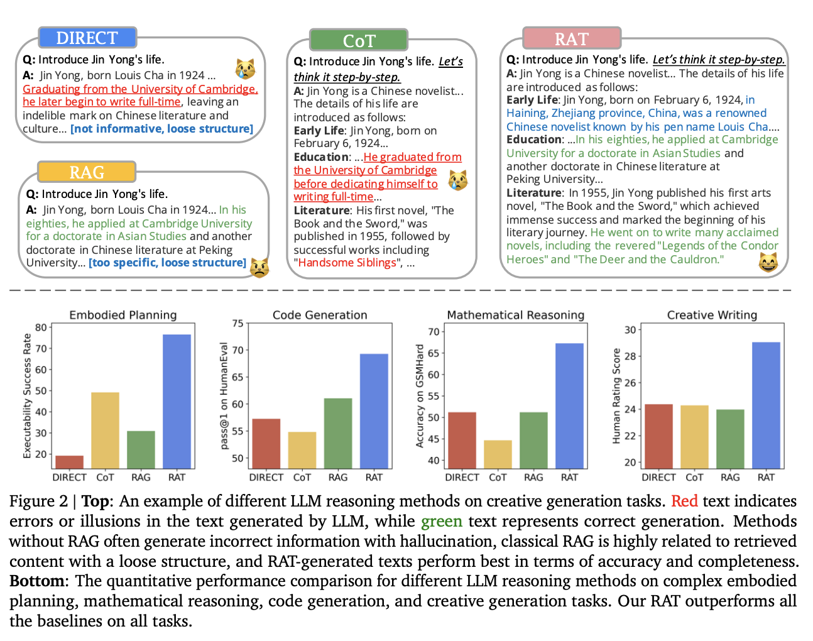

# [Large Multimodal Agents: A Survey](https://arxiv.org/pdf/2402.15116.pdf)
簡易まとめ：自分の言葉でまとめたもの。  
GPT翻訳：GPTで翻訳した全文。  

# 簡易まとめ
## abstract
外部情報の検索を用いた、思考連鎖の反復的な改良が、大規模言語モデルでの長期生成タスクの推論と生成能力を大幅に向上させるが、幻覚の発生が課題である。  
提案するRATでは、ゼロショットで生成したCoTを、タスククエリや現在および過去の思考ステップに関連する情報用いて、一つ一つの思考ステップを改訂できる。  
RATをGPT-3.5、GPT-4、そしてCodeLLaMA-7bに適応することで、  
コード生成で平均13.63％、数学的推論で16.96％、創造的なライティングで19.2％、身体的タスク計画で42.78％の評価スコアが相対的に増加した。デモは[ここ](https://craftjarvis.github.io/RAT)。  

## 1. introduction
LLMは、様々な自然言語推論タスクにおいて大きな進歩を遂げている。  
特に、高度なプロンプト戦略、思考の連鎖（CoT）プロンプトを組み合わせた場合に上手くいっている。  
同時に、LLMの推論の正確性について課題感も増えている。  
具体的には、モデルの応答や中間推論パス(CoTの連鎖中)における幻覚である。  
この課題は、ゼロショットCoTプロンプト(ステップ・バイ・ステップで考えよう)や、複数ステップでの処理や、文脈認識推論が必要な長期生成タスクで重要である。  

この課題に対し、様々なプロンプト技術が提案されている。  
有望なのはRAGで、RAGでは外部データを取得して、より事実に基づいた推論を可能にする。  
本論では、このRAGを高度な長期推論とどのように利用すると良いかを探求する。  
筆者らは、中間推論時の幻覚は、外部の知識の利用により軽減できると考えている。  
図1に本論の手法のイメージを示す。  

図1: RATパイプライン  

step0(図1の左)の流れは、ユーザーが質問を生成・LLMが回答のためのタスクをゼロショットで分解・分解したタスクを順番づけて実行する。  
step1~n(図1の右)の流れは、step0で生成されたnステップの回数、実施される。  
■ step1の流れ  
【Retrieval】Cotで作られた最初のタスクT1を用いて、関連する情報R1が検索される。  
【Augmented Revision】I(元のユーザープロンプト)と、R1(関連情報)を使って $T_1^\*$ を生成する。  
【Revised CoTs】 $T_1^\*$ と元のCoTを組み合わせて、新しいCoTを生成する。  
■ stepNの流れ
【Retrieval】改良した $T_1^\*$ ~ $T_{n-1}^\*$ と $T_n$ を用いて、関連する情報 $R_n$ を検索する。  
【Augmented Revision】改良した $T_1^\*$ ~ $T_{n-1}^\*$ と、I(元のユーザープロンプト)と、 $R_n$ (関連情報)を使って $T_n^\*$ を生成する。  
【Revised CoTs】 $T_1^\*$ ~ $T_{n}^\*$ で新しいCoTを生成する。  

※ Augmented Revisionのstep1で、 $T_1^\*$ が入力になっているように見えるけど、多分ミスだと思う。  
n-1までの $T_{n-1}^\*$ が入力になるはず。なぜなら、Revisionが目的なのに、 $T_1^\*$ が分かっているならこれをする必要がないから。  

上記の戦略は、2つの主要なアイデアで成り立つ。  
1. LLMによって生成されたゼロショットCoTと大元のタスクプロンプトから、CoTを改訂するのに役立つ情報を取得する。  
2. タスクプロンプトを修正し、過去ステップと現在ステップの情報で、現在のタスクステップを改訂する。  

これは、タスク実行中に、長いステップを踏む必要があるが、その各ステップ中に外部知識を活用することで、精度を上げる行為であり、人間の段階的な思考ステップに似ている。  
図2に、RATと他の手法の比較を示す。  

図2: 様々なLLMでの回答生成の比較  

赤がハルシネーションで、緑が正しい文章。  
RATやRAGはハルシネーションに強く、RATはRAGよりも良い。  
コード生成、数学的推論、身体的タスク計画、創造的ライティングの長期タスクに適用して評価した。  
利用したLLMモデルは、GPT-3.5、GPT-4、CodeLLaMA7b。  

結果はそれぞれ以下。  

| タスク    | 種類         | 評価結果      |
|--------|------------|-----------|
| コード生成  | HumanEval  | +20.94%   | 
| コード生成  | HumanEval+ | +18.89%   |
| コード生成  | MBPP       | +14.83%   |
| コード生成  | MBPP+      | （+1.86%）  |
| 数学的推論  | GSM8K      | （+8.36%）  |
| 数学的推論  | GSMHard    | （+31.37%） |
| Minecraftタスク計画  | none       | 実行可能性で2.96倍、妥当性で+51.94% |
| 創造的ライティング  | none       | +19.19% |

また、ablation study(あえて機能を削除し、有効性を確認する方法)により、1) RAGを使用したCoTの改訂と、2)進行的な改訂および生成が果たす重要性を確認する。  
本論では、人間が行うように、外部の知識の助けを借りて、LLMがゼロショット方式で推論プロセスをどのように改訂するかを明らかにする。

# GPT翻訳
## abstract
「情報検索を用いた思考連鎖の反復的な改訂が、長期生成タスクにおける大規模言語モデルの推論と生成能力を大幅に向上させる一方で、幻覚の発生を大幅に軽減することを探求します。  
特に、提案された方法であるリトリーバル拡張思考（RAT）は、ゼロショットCoTが生成された後、タスククエリ、現在および過去の思考ステップに関連する情報を検索して、  
一つ一つの思考ステップを改訂します。  
RATをGPT-3.5、GPT-4、そしてCodeLLaMA-7bに適用することで、これらのモデルの長期生成タスクにおけるパフォーマンスが顕著に向上し、  
コード生成で平均13.63％、数学的推論で16.96％、創造的なライティングで19.2％、身体的タスク計画で42.78％の評価スコアが相対的に増加しました。  
デモページは https://craftjarvis.github.io/RAT で見ることができます。  

## 1. introduction
大規模言語モデル（LLM）は、様々な自然言語推論タスクにおいて実り多い進歩を遂げています、特に大規模モデルと高度なプロンプト戦略、  
特に思考の連鎖（CoT）プロンプトを組み合わせた場合です。  
しかし、LLMの推論の事実的な正確性についての懸念が増えています。  
これは、モデルの応答や中間推論パス、すなわちCoTにおける可能な幻覚を引用しています。  
この問題は、ゼロショットCoTプロンプト、いわゆる「ステップ・バイ・ステップで考えよう」や、  
複数ステップおよび文脈認識推論が必要な長期生成タスク（コード生成、タスク計画、数学的推論など）においてさらに重要になります。  
事実上有効な中間思考は、これらのタスクの成功完了には重要です。  

この問題を軽減するために、いくつかのプロンプト技術が提案されています。  
その中で有望な方向性であるリトリーバル拡張生成（RAG）は、人間の推論からの洞察を求め、より事実に基づいた推論を促進するために取得した情報を活用します。  
本論文では、RAGを高度な長期推論とどのように相乗効果を発揮させるかを探求します。  
私たちの直感では、中間推論過程内の幻覚は外部の知識の助けによって軽減される可能性があります。  
結果として提示されるプロンプト戦略、リトリーバル拡張思考（RAT）は図1で示されています。  

図1: RATパイプライン  

私たちの戦略は2つの主要なアイデアを含みます。  
まず、LLMによって生成された初期のゼロショットCoTと元のタスクプロンプトを使用して、おそらく欠陥のあるCoTを改訂するのに役立つ情報を取得します。  
次に、CoT全体を取得して一度に最終的な応答を生成するのではなく、LLMがCoT（一連のサブタスク）に従ってステップバイステップで応答を生成し、  
現在の思考ステップのみがタスクプロンプト、現在および過去のCoTで取得した情報に基づいて改訂される段階的なアプローチを考案します。  
この戦略は、複雑な長期問題解決中に外部知識を活用して段階的に思考を調整する人間の推論プロセスに例えることができます。  
RATとその対象との比較は図2で見ることができます。  

図2: 様々なLLMでの回答生成の比較  

RATを、コード生成、数学的推論、身体的タスク計画、創造的ライティングを含む幅広い困難な長期タスクに適用して評価しました。  
さまざまな規模の複数のLLMを使用します：GPT-3.5、GPT-4、CodeLLaMA7b。  
結果は、これらのLLMにRATを組み合わせることが、標準のCoTプロンプトやRAGアプローチよりも大きな利点をもたらすことを示しています。  
特に、私たちが選択したタスク群全体で新たな最先端のパフォーマンスレベルを観察します：  
1) コード生成では、HumanEval（+20.94%）、HumanEval+（+18.89%）、MBPP（+14.83%）、MBPP+（+1.86%)
2) 数学的推論問題では、GSM8K（+8.36%）、GSMHard（+31.37%）
3) Minecraftタスク計画（実行可能性で2.96倍、妥当性で+51.94%）
4) 創造的ライティング（人間のスコアで+19.19%）

追加の削除研究は、RATの二つの主要な要素、すなわちRAGを使用したCoTの改訂と進行的な改訂および生成が果たす重要な役割をさらに確認します。  
この研究は、人間が行うように、外部の知識の助けを借りて、LLMがゼロショット方式で推論プロセスをどのように改訂するかを明らかにしています。  

## 2. Retrieval Augmented Thoughts
LLMを使用する際に、長期的な推論と生成をサポートし、幻覚を軽減することが私たちの目標です。  
長期的なタスクに満足のいくパフォーマンスを得るためには、二つの要素が不可欠です。  
まず、事実情報へのアクセスは、検索によって容易にされることができます。  
次に、複雑なタスクを完了するためのスクラッチパッドを概説する適切な中間ステップは、CoTによって容易にされることができます。  
しかし、これら二つを単純に組み合わせるだけでは必ずしも改善につながるわけではありません。  
依然として二つの疑問が残ります：(1) どのような情報が検索に関連するか、(2) 関連する事実情報を用いて推論ステップをどのように効果的に修正するか。  
この二つの疑問にどのように対処できるかをより深く理解するために、まずRAGとCoTの簡単な導入を提供します。  

### 2-1. Preliminary
#### Retrieval-Augmented Generation(RAG）
RAGは、信頼できる情報源から抽出された関連テキストを大規模言語モデル（LLM）に提供することで、架空の事実を生成する問題に対処します。  
これは主に、質問応答（QA）タスクで使用されます。  
具体的には、𝑛個の候補文書の集合 $𝑅 := \lbrace 𝑅_𝑖 \rbrace _{i=1}^n$ に対して、クエリ𝑄に関連する最も適切な文書を取得することを目指しています。  
クエリ𝑄は、質問/タスクのプロンプト自体またはLLMによって生成された関連情報です。  
これを実現するために、RAGはまず、文書のセマンティックに意識した埋め込み $𝑟_𝑖 := emb(𝑅_𝑖) ∈ \mathbb{R}^𝐾$ （𝐾は埋め込みのサイズ）とクエリの埋め込み $𝑞 := emb(𝑄) ∈ \mathbb{R}^𝐾$ を抽出します。  
emb(·)は、Sentence-BERTなどの様々なテキスト埋め込みモデルで実装することができます。  
クエリと文書の関連性は、それらのコサイン類似度によって測定されます：  

$$
sim(Q, R_i) = \frac{q \cdot r_i}{\| q \| \| r_i \|}
$$

その関連性に基づいて、トップランクの𝑘個の文書がLLMのプロンプトに供給され、最終的な答えを生成します。  
このような豊かで事実に基づいた文脈によって、RAGはLLMの幻覚を軽減します。  
しかし、複雑な推論タスク（例えば、複数ステップの推論が必要なタスク）は、効果的な検索クエリに翻訳することが困難であり、関連文書を見つけることへの課題を生じさせ、RAGの適用性を低下させます。  
従来のRAGは、一度にすべての関連情報を取得します。  
しかしながら、それは後続の推論や生成ステップで必要な「事実」や情報が何であるかを予測することが困難である事実を見過ごしています。  
タスクのプロンプト自体では、これに対する十分な手がかりを提供するのにほとんど役立ちません。  

#### Chain of Thoughts（CoT）
思考の連鎖（Chain of Thoughts, CoT）プロンプトは、複雑な推論ステップを必要とするタスクの下での大規模言語モデル（LLM）のパフォーマンスを向上させるように設計されています。  
これには、複数ステップの数学的言語問題などが含まれます。  
具体的には、LLMに直接正解を生成させる代わりに、CoTプロンプトはLLMに、タスクのためのスクラッチスペースとして機能する中間推論ステップ、  
すなわち思考を最初に出力させ、その後それらを最終回答に要約させるよう促します。  
このようなLLMの振る舞いは、ゼロショットでCoT推論を奨励する用語（例えば「ステップバイステップで考えよう」）によって刺激されるか、  
類似のタスクでCoTを実行する数ショットの例によって引き起こされることがあります。  
しかしながら、中間思考に直接的な監視がなされていないため、LLMは関連するドメイン知識が欠けているためだったり、幻覚によって偏っているためにエラーを犯す可能性があります。  

### 2.2. Our Approach
前述のCoTプロンプトとRAGの問題を緩和するための直感は、CoTプロンプトによって生成された各思考ステップをRAGで修正することを適用することです。  
概要は図1およびアルゴリズム1で見ることができます。  

アルゴリズム1: RATの簡易アルゴリズム  

具体的には、タスクプロンプトIを与えた後、まずLLMにゼロショットでステップバイステップの思考（「ステップバイステップで考えよう」)  
$𝑇 := \lbrace 𝑇_𝑖 \rbrace _{i=1}^n$ を生成させます。  
ここで $𝑇_i$ はi番目の思考ステップを表します。  
長期生成タスクでは、𝑇はコード生成の疑似コードとコメント、創造的ライティングの記事の概要など、中間推論ステップであるか、  
または図1に示されるような身体的タスク計画のサブゴールのリストなどのドラフト応答そのものであるかのどちらかです。  

𝑇が不完全である可能性がある（例えば、幻覚を含む）ため、最終応答を生成する前に、生成された各思考ステップをRAGで修正します。  
具体的には、以前の思考ステップを固定したと仮定して、 $𝑇_{1:𝑖}$ を修正することになった場合、  
テキスト $\lbrace I, 𝑇_1, . . . , 𝑇_𝑖 \rbrace $をクエリ $𝑄_𝑖$ に変換します。  
$$
𝑄_𝑖 = ToQuery(I, 𝑇_1, . . . , 𝑇_𝑖)  
$$  
ここでToQuery(·)はテキストエンコーダまたはタスクプロンプトI、現在および過去の思考ステップ𝑇1, . . . , 𝑇𝑖をクエリ𝑄𝑖に変換できるLLMのいずれかです。  
RAGを採用して、クエリ𝑄𝑖を使用して関連文書𝑅𝑖を取得し、それをプロンプトに追加して修正された思考ステップ𝑇★𝑖を生成します：𝑇★1:𝑖 = 𝑝𝜃(·|I, 𝑇1, . . . , 𝑇𝑖, 𝑅𝑖)。  

最終的に、実際のタスクに応じて、修正された思考ステップ𝑇★1:𝑛は、例えば身体的タスク計画など、そのまま最終モデル応答として使用されることもあります。  
コード生成や創造的ライティングのようなタスクでは、LLMにさらにプロンプトを与えて、各修正された思考ステップから完全な応答（コード、文章）をステップバイステップで生成させます。  
𝑇𝑖の思考ステップを修正する際、現在のステップ𝑇𝑖のみを使用するのではなく、完全な思考の連鎖𝑇1, . . . , 𝑇𝑛を使ってRAGのためのクエリを生成するのではなく、  
現在の思考ステップ𝑇𝑖とそれまでの修正された思考ステップ𝑇★1:𝑖−1からクエリ𝑄𝑖を生成することを確認します。  
つまり、RAGを使用して思考を修正する際には因果的な推論を採用します：𝑄𝑖 = ToQuery(𝐼, 𝑇★1:𝑖−1, 𝑇𝑖)、𝑇★1:𝑖 = 𝑝𝜃(·|𝐼, 𝑇★1:𝑖−1, 𝑇𝑖, 𝑅𝑖)。  

