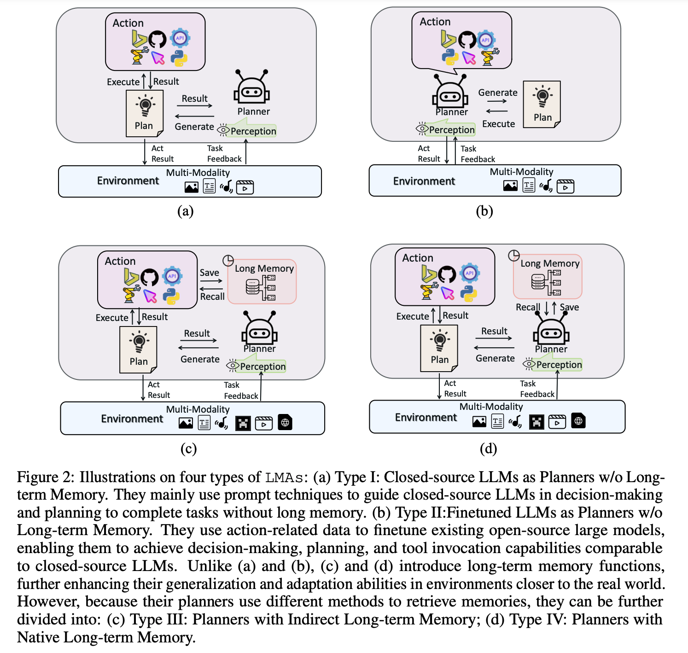

# [Large Multimodal Agents: A Survey](https://arxiv.org/pdf/2402.15116.pdf)
簡易まとめ：自分の言葉でまとめたもの。  
GPT翻訳：GPTで翻訳した全文。  

## GPT翻訳
### Abstruct
大規模言語モデル（LLM）は、テキストベースのAIエージェントを駆動する上で卓越した性能を発揮し、人間に似た意思決定や推論能力をこれらに与えています。  
同時に、これらのLLMで駆動されるAIエージェントを多モーダル領域へと拡張する研究の新たなトレンドが現れています。  
この拡張により、AIエージェントは多様な多モーダルユーザークエリを解釈し、応答することが可能となり、より複雑で微妙なタスクを処理できるようになります。  
本論文では、大規模多モーダルエージェント（略称LMAs）と呼ばれるLLM駆動の多モーダルエージェントに焦点を当てた体系的なレビューを行います。  
まず、LMAsを開発する上での必須コンポーネントを紹介し、現在の研究を4つの異なるタイプに分類します。  
その後、複数のLMAsを統合する協調フレームワークをレビューし、集合的な効果を高めます。  
この分野における重要な課題の一つは、異なるLMAs間での効果的な比較を妨げる、既存研究における多様な評価方法です。  
そのため、これらの評価方法論をまとめ、ギャップを埋めるための包括的なフレームワークを確立します。  
このフレームワークは、評価を標準化し、より意味のある比較を促進することを目的としています。  
レビューを締めくくるにあたり、LMAsの広範な応用を強調し、将来の研究方向性を提案します。  
私たちの議論は、この急速に進化する分野における将来の研究に対する貴重な洞察とガイドラインを提供することを目的としています。  
最新のリソースリストはhttps://github.com/jun0wanan/awesome-large-multimodal-agentsで利用可能です。  

### 1. Introduction
エージェントとは、環境を知覚し、これらの知覚に基づいて特定の目標を達成するための決定を下す能力を持つシステムです[56]。  
狭いドメインでは熟練しているものの、初期のエージェント[35, 50]は適応性と一般化が欠けており、人間の知能との顕著な差異が強調されます。  
最近の大規模言語モデル（LLM）の進歩は、このギャップを埋め始めています。  
ここでは、LLMがコマンド解釈、知識の同化[36, 78]、および人間の推論や学習の模倣[21, 66]の能力を高めています。  
これらのエージェントは、主要な意思決定ツールとしてLLMを使用し、記憶などの重要な人間らしい特徴でさらに強化されています。  
この強化により、彼らはさまざまな自然言語処理タスクを扱い、言語を使用して環境と対話することができます[40, 38]。  

実際のシナリオでは、テキストを超えた情報がしばしば関与し、視覚的側面に重点を置いた複数のモダリティを包含しています。  
その結果、LLMで駆動されるインテリジェントエージェントの次の進化のステップは、特に視覚データを含む多モーダル情報を処理し生成する能力を獲得することです。  
この能力は、これらのエージェントが人間レベルの知能を反映したより堅牢なAIエンティティへと進化するために不可欠です。  
この能力を備えたエージェントは、私たちの論文では大規模多モーダルエージェント（LMA）として言及されています。  
通常、これらは言語のみのエージェントよりも複雑な課題に直面します。  
例えば、ウェブ検索を例に取ると、LMAはまず検索バーを通じて関連情報を探すためのユーザー要件の入力が必要です。  
その後、マウスクリックやスクロールを通じてウェブページにナビゲートし、リアルタイムのウェブページコンテンツをブラウズします。  
最後に、LMAは多モーダルデータ（例えば、テキスト、動画、画像）を処理し、ウェブ記事、動画レポート、ソーシャルメディアの更新から重要な情報を抽出し、この情報を統合してユーザーのクエリに応答するという多段階の推論を行う必要があります。  
既存のLMAに関する研究が孤立して行われたため、既存のフレームワークを要約し比較することにより、この分野をさらに進展させる必要があることに注意しています。  
LLMで駆動されるエージェントに関連するいくつかの調査が存在します[60, 42, 49]が、そのうちのいくつかは多モーダル側面に焦点を当てています。  

本論文では、LMAの主要な発展をまとめることでこのギャップを埋めることを目指しています。  
まず、コアコンポーネントについての導入（§2）を行い、既存研究に対する新たな分類法を提案します（§3）。  
さらに、既存の協力フレームワークについて議論します（§4）。  
評価に関しては、LMAの性能を評価するための既存の方法論を概説し、その後に包括的な要約を提供します（§5）。  
次に、アプリケーションセクションでは、多モーダルエージェントとそれに関連するタスクの広範な実世界アプリケーションについての徹底的な概観を提供します（§6）。  
この作業を締めくくり、LMAに対する可能な将来の方向性について議論し、有益な研究ガイダンスを提供することを提案します。  

### 2 The Core Components of LMAs
このセクションでは、知覚、計画、行動、および記憶を含むLMAの四つの核心要素について詳述します。  

#### 知覚(Perception)
知覚は、人間が環境情報を収集し解釈することを可能にする複雑な認知プロセスです。  
LMAにおける知覚コンポーネントは、主に多様な環境からの多モーダル情報を処理することに焦点を当てています。  
表1に示されているように、異なるタスクのLMAは様々なモダリティを含んでいます。  
これら異なるモダリティからタスク完了に最も有益な鍵となる情報を抽出することが求められ、これによってより効果的な計画とタスクの実行が促進されます。  

多モーダル情報の処理に関する初期の研究[57, 43, 70, 9]は、画像や音声をテキスト説明に変換するための単純な相関モデルやツールに頻繁に依存していました。  
しかし、この変換アプローチは、特に複雑なモダリティ（例えば、ビデオ）に関して、大量の無関係で冗長な情報を生成する傾向があります。  
入力の長さの制約と共に、LLMは効果的に関連情報を抽出し計画に役立てることにおいて頻繁に課題に直面しています。  
この問題を解決するため、最近の研究[71, 47]では、洗練されたデータタイプを扱うために設計されたサブタスクツールの概念を導入しました。  
実世界に似た環境（つまり、オープンワールドゲーム）において、[51]は非テキストモダリティ情報を処理するための新しい方法を提案しました。  
このアプローチは、環境から重要な視覚ボキャブラリーを抽出することから始まり、その後GPTモデルを使用してこのボキャブラリーを一連の記述的な文章にさらに洗練させます。  
LLMが環境内の視覚モダリティを知覚するとき、それらを使用して最も関連性の高い記述的な文章を取得し、これによって周囲の理解を効果的に高めます。  

#### 計画(Planning)
計画者は、人間の脳の機能に似て、LMAにおいて中心的な役割を果たします。  
彼らは現在のタスクについて深い推論を行い、それに応じた計画を立てる責任があります。  
言語のみのエージェントと比べて、LMAはより複雑な環境で動作するため、合理的な計画を立てることがより困難になります。  
私たちは、計画者を4つの視点（モデル、形式、検査＆反省、および計画方法）から詳述します：  

モデル  
表1に示されているように、既存の研究は異なるモデルを計画者として採用しています。  
その中でも、最も人気のあるものはGPT-3.5やGPT-4 [43, 41, 9, 30, 57, 51]です。  
しかし、これらのモデルは公開されていないため、一部の研究ではLLaMA [67]やLLaVA [23]のようなオープンソースモデルの使用にシフトし始めています。  
後者は複数のモダリティの情報を直接処理することができ、より最適な計画を立てる能力を高めます。  

形式  
計画者によって立てられた計画をどのように形式化するかを表します。  
表1に示されているように、2つの形式化方法があります。  
最初のものは自然言語です。  
例えば、[41]では、得られた計画内容は「最初に行ったことは、画像内の少年のポーズを分析するためにOpenCVのopenposeコントロールモデルを使用することでした...」であり、計画されたのは「OpenCVのopenposeコントロールモデルを使用する」ことです。  
2番目のものはプログラムの形式で、「image_patch = ImagePatch(image)」と[43]で説明されているように、計画の実行にImagePatch関数を呼び出します。[9]  
のように、ハイブリッド形式も存在します。  

検査＆反省  
複雑な多モーダル環境でLMAが一貫して意味のあるタスク完了計画を立てることは難しいです。  
このコンポーネントは、堅牢性と適応性を高めることを目指しています。  
いくつかの研究方法[51, 52]は、計画を導くために多モーダル状態を含む成功体験を長期記憶に保存します。  
計画プロセス中、彼らはまず関連する経験を取り出し、計画者が不確実性を減らすために慎重な検討を助けます。  
さらに、[12]は同じタスクを実行する際に異なる状態で人間によって作られた計画を利用します。  
類似の状態に遭遇したとき、計画者はこれらの「標準答え」を熟考のために参照し、より合理的な計画につながります。  
さらに、[71]はモンテカルロのようなより複雑な計画方法を採用し、最適な計画戦略を見つけるために計画検索の範囲を拡大します。  

計画方法  
既存の計画戦略は、表1に示されているように、動的計画と静的計画の2つのタイプに分類できます。  
前者[57, 43, 70, 30, 41]は、Chain of Thought (CoT) [80]に似て、初期入力に基づいて目標を一連のサブプランに分解することを指し、プロセス中にエラーが発生しても計画は再構成されません。  
後者[9, 25, 51, 71]は、各計画が現在の環境情報またはフィードバックに基づいて形成されることを意味し、計画にエラーが検出された場合、再計画のために元の状態に戻ります[12]。  

行動  
多モーダルエージェントシステムにおける行動コンポーネントは、計画者によって立案された計画や決定を実行する責任があります。  
これらの計画をツールの使用、身体運動、インターフェースとの相互作用などの特定の行動に変換し、エージェントがその目標を達成し、正確かつ効率的に環境と相互作用できるようにします。  
私たちの議論は、タイプとアプローチの2つの側面に焦点を当てています。

表1の行動は、ツールの使用（T）、身体的行動（E）、仮想行動（V）の3つのカテゴリーに分類されています。  
ここでツールには、ビジュアルファンデーションモデル（VFMs）、API、Pythonなどが含まれます（表2に記載されています）；  
身体的行動は、ロボット[32, 7]や仮想キャラクター[51, 52, 45, 68]などの物理的実体によって実行されます；  
仮想行動[8, 76, 44, 54]には、ウェブタスク（例：リンクをクリックする、スクロールする、キーボードを使用する）が含まれます。  
アプローチに関しては、表1に示されているように、主に2つのタイプがあります。  
最初のタイプは、実行可能な行動についての情報をエージェントに提供するためにプロンプトを使用することを含みます。  
例えば、その時点で利用可能なツールとその機能です；  
二番目のタイプは、行動に関するデータを収集し、この情報を利用してオープンソースの大規模モデル、例えばLLaVA[23]の微調整プロセスを自己指導することを含みます。  
このデータは、通常、GPT-4のような高度なモデルによって生成されます。  
言語のみのエージェントと比較して、行動に関連する情報やデータの複雑さは、学習戦略を最適化するためにより洗練された方法を必要とします。  

記憶  
初期の研究では、記憶メカニズムが汎用エージェントの運用において重要な役割を果たすことが示されています。  
人間と同様に、エージェントにおける記憶は長期記憶と短期記憶に分類することができます。  
単純な環境では、短期記憶だけでエージェントが手元のタスクを処理するのに十分です。  
しかし、より複雑で現実的な設定では、長期記憶が不可欠になります。  
表1でわかるように、長期記憶を取り入れているLMAは少数派です。  
言語のみのエージェントとは異なり、これらの多モーダルエージェントは、様々なモダリティを横断して情報を保存できる長期記憶を必要とします。  
いくつかの研究[71, 47, 69, 7]では、すべてのモダリティが記憶のためにテキスト形式に変換されます。  
しかし、[51]では、以前の成功体験をアーカイブするために特別に設計された多モーダル長期記憶システムが提案されています。  
具体的には、これらの記憶はキー値ペアとして保存され、キーは多モーダル状態であり、値は成功した計画です。  
新しい多モーダル状態に遭遇した際には、エンコードされた類似性に基づいて最も類似した例が取り出されます：  

ここで、 $k_t$ はCLIPモデルを通じてエンコードされたキーの視覚情報を表し、現在の視覚状態 $k_x$ との類似性を比較されます。  
$k_x$ もCLIPによってエンコードされます。  

### 3 The Taxonomy of LMAs
このセクションでは、既存の研究を4つのタイプに分類して体系化します。  

#### タイプI
長期記憶なしでクローズドソースのLLMを計画者として使用。  
初期の研究[11, 43, 57, 41, 9, 25]は、推論と計画のためにクローズドソースの大規模言語モデル（例えば、GPT-3.5）をプランナーとして利用するためにプロンプトを用いています。  
これらの計画の実行は、特定の環境やタスク要件に応じて、下流のツールキットを使用したり、マウスやロボットアームのような物理デバイスを使って環境と直接対話したりすることで行われることがあります。  
このタイプのLMAは、通常、画像編集、ビジュアルグラウンディング、ビジュアルクエスチョンアンサリング（VQA）などの従来のタスクを行う比較的シンプルな設定で動作します。  

#### タイプII
長期記憶なしでファインチューンされたLLMを計画者として使用。  
このタイプのLMAは、多モーダル指示に従うデータを収集するか、自己指導を用いてオープンソースの大規模言語モデル（例えば、LLaMA）[67]や多モーダルモデル（例えば、LLaVA）[23, 46]をファインチューンすることを含みます。  
この強化により、モデルは推論と計画のための中心的な「脳」としてのみならず、これらの計画の実行も可能になります。  
タイプIIのLMAが直面する環境とタスクは、タイプIと似ており、通常は伝統的なビジュアルまたは多モーダルタスクを含みます。  

#### タイプIII
間接的な長期記憶を持つ計画者。  
タイプIIIのLMA[71, 47]では、LLMが中心的なプランナーとして機能し、長期記憶を備えています。  
これらのプランナーは、関連するツールを呼び出して長期記憶にアクセスし、これらの記憶を活用して推論と計画を強化します。  
例えば、[71]で開発された多モーダルエージェントフレームワークは、ビデオ処理のような動的なタスク向けにカスタマイズされています。  

#### タイプIV
ネイティブな長期記憶を持つ計画者。  
タイプIIIとは異なり、タイプIVのLMA[51, 37, 7, 76]は、ツールを介さずに長期記憶と直接対話するLLMを特徴としています。  
例えば、[51]で提案された多モーダルエージェントは、Minecraftのオープンワールドコンテキスト内で200以上の異なるタスクを完了する能力を示しています。  

### 4 Multi-agent Collaboration
このセクションでは、孤立したエージェント内の議論を超えて、LMAsのための協力フレームワークをさらに紹介します。  

図3(a)(b)に示されているように、これらのフレームワークは、複数のLMAが協力して作業することを採用しています。  
2つのフレームワークの間の主な区別は、メモリコンポーネントの存在または不在にありますが、その基本原理は一貫しています：  
複数のLMAが異なる役割と責任を持ち、それによって行動を調整し、共通の目標を集団的に達成できるようにします。  
この構造は単一のエージェントにかかる負担を軽減し、タスク性能を向上させます[12, 37, 17, 29]。  

例えば、表1では、[37]による多モーダルエージェントフレームワークでは、多モーダル環境を感知するためのperceiverエージェントが導入されており、大規模な多モーダルモデルで構成されています。  
Patrollerとして指定されたエージェントは、perceiverエージェントとの複数の相互作用に従事し、現在の計画と行動の正確性を確保するために、知覚された環境データに対してリアルタイムのチェックとフィードバックを行う責任があります。  
実行失敗が検出されたり、再評価が必要になった場合、Patrollerは計画者に関連情報を提供し、サブゴールの下での行動シーケンスの再編成または更新を促します。  
MemoDroidフレームワーク[17]は、協力してモバイルタスクを自動化するいくつかの重要なエージェントで構成されています。  
Explorationエージェントは、ターゲットアプリケーションインターフェースのオフライン分析を担当し、UI要素に基づいて潜在的なサブタスクのリストを生成し、それをアプリケーションメモリに保存します。  
オンライン実行フェーズ中には、Selectionエージェントがユーザーコマンドと現在の画面状態に基づいて、探索されたセットから実行する具体的なサブタスクを決定します。  
Deductionエージェントは、選択されたサブタスクに必要な基本的な行動シーケンスを特定し、LLMをプロンプトして完了させます。  
同時に、以前に学習したタスクに似たタスクに遭遇した場合、Recallエージェントは直接、対応するサブタスクと行動シーケンスをメモリから呼び出して実行できます。  

### 5 Evaluation
現在のLMAの能力向上に関する研究が主流ですが、これらのエージェントの評価とアセスメントのための方法論の開発には限定的な努力が注がれています。  
大半の研究は、性能評価に従来の指標に依存し続けており、LMAの評価に固有の課題を明確に示しています。  
これはまた、この分野で実用的な評価基準を開発し、ベンチマークデータセットを確立する必要性を強調しています。  
このセクションでは、LMAの既存の評価を要約し、将来の発展に対する見解を提供します。  

#### 5.1 主観的評価
主観的評価は主に、これらのLMAの能力を人間が評価することを指します。  
私たちの究極の目標は、人間のように世界を理解し、さまざまなタスクを自律的に実行できるLMAを作成することです。  
したがって、LMAの能力に対する人間ユーザーの主観的評価を採用することが重要です。  
主な評価指標には、多才性、ユーザーフレンドリーさ、スケーラビリティ、価値および安全性が含まれます。  

多才性  
多才性は、LMAが多様なツールを巧みに利用し、物理的および仮想的な行動を実行し、さまざまなタスクを管理する能力を示します。  
[30]は、既存のLMAで利用されるツールの種類と規模を比較し、それらの能力の多様性を評価することを提案しています。  

ユーザーフレンドリーさ  
ユーザーフレンドリーさは、LMAが完了したタスクの成果に対するユーザーの満足度、効率、正確さ、結果の豊かさを含みます。  
このタイプの評価は比較的主観的です。[64]  
では、LMAの人間による評価が、ユーザー指示を解釈して実行する効果を正確に評価するために不可欠です。  

スケーラビリティ  
スケーラビリティは、LMAが新しい能力を取り込み、新たな課題に対処できる能力を基本的に評価します。  
人間の要求のダイナミックな性質を考えると、LMAの適応性と生涯学習の可能性を厳格に評価することが不可欠です。  
例えば、[23]の評価は、エージェントがこれまでに見たことのないツールを使用してタスクを完了する能力に焦点を当てています。  

価値と安全性  
先に述べた指標に加えて、「価値と安全性」指標は、エージェントの実用的な意義と人間ユーザーに対する安全性を判断する上で重要な役割を果たします。  
多くの現在の評価がこの指標を見過ごしている一方で、LMAの「価値と安全性」を考慮することが不可欠です。  
言語エージェントと比較して、LMAはより広範なタスクカテゴリーを扱うことができるため、人間社会の価値観と一致する倫理的および道徳的原則に従うことがさらに重要になります。  

#### 5.2 客観的評価
主観的評価とは異なり、客観的評価は定量的な指標に依存してLMAの能力を包括的、系統的、標準化された方法で評価します。  
これは現在、多モーダルエージェント研究で最も広く採用されている評価方法です。  

指標  
指標は客観的評価において重要な役割を果たします。  
現在の多モーダルエージェント研究[43, 70, 9, 71, 12, 57, 30]では、ビジュアルクエスチョンアンサリング（VQA）[10, 43]のようなタスクでエージェントが生成した回答の正確性など、特定のタスク関連指標が使用されています。  
しかし、LLMの出現以前に確立された従来のタスク指標は、LLM駆動のLMAを評価するのに十分効果的ではありません。  
その結果、より適切な評価指標を特定するための研究努力が増加しています。  
たとえば、VisualWebArena [16]では、視覚的に導かれたタスクを扱うLMAのパフォーマンスを評価するために特別に設計された評価指標があります。  
これには、ウェブページコンテンツのエージェントの視覚理解の正確性、Set-of-Marksによってマークされた操作可能な要素を認識して利用する能力、タスク目標に基づいて状態遷移を達成する能力などが含まれます。  

ベンチマーク  
ベンチマークは、評価基準、データセット、タスクのスイートを包含するテスト環境を表します。  
これは、異なるアルゴリズムやシステムの性能を評価し比較するために利用されます。  
従来のタスク[30, 12, 57, 23]のベンチマークと比較して、SmartPlay[58]は、LMAの様々な能力を包括的に測定するために慎重に設計された一連のゲームを使用しており、各能力に対する詳細な評価指標とチャレンジレベルを設定しています。  
ゲームを使用して評価するアプローチとは対照的に、GAIA[34]は466の質問とその回答からなるテストセットを開発しました。  
これらの質問は、AIシステムが推論、多モーダル情報の処理、ウェブナビゲーション、熟練したツール使用など、基本的な能力の範囲を持つことを要求します。  
人間に対してますます難しいタスクを作成する現在の傾向から逸脱し、それは既存の先進的なAIシステムにとって概念的に単純だが挑戦的な質問に焦点を当てています。  
これらの質問は、複雑な操作シーケンスの正確な実行を必要とする実世界のシナリオを含み、出力は容易に検証可能です。  
同様に、VisualWebArena[16]は、実際のウェブページ上での視覚的およびテキスト理解タスクを処理するLMAの能力を評価し進化させるために設計されたベンチマークテストスイートです。  
他にも[31, 61]のようなベンチマークがあり、エージェントの能力を効果的にテストしています。  

### 6 Application
多様なデータモダリティを処理する能力に優れたLMAsは、さまざまなシナリオにおける意思決定と応答生成で言語のみのエージェントを超えています。  
彼らの適応性は、図4に示されているように、実世界の多感覚環境で特に有用です。  

#### GUIオートメーション
このアプリケーションにおいて、LMAの目的は、ユーザーインターフェース内で人間の行動を理解し模倣することにあり、繰り返しタスクの実行、複数のアプリケーションを横断するナビゲーション、複雑なワークフローの簡素化を可能にします。  
このオートメーションは、ユーザーの時間とエネルギーを節約し、彼らがより重要で創造的な仕事の側面に集中できるようにする可能性を持っています[44, 6, 53, 64, 75, 69, 54, 17, 8]。  
例えば、GPT-4V-Act[6]は、GPT-4Vの能力とウェブブラウジングを組み合わせた進歩的なAIで、人間とコンピュータのインタラクションを向上させることを主な目標としています。  
その主な目標は、ユーザーインターフェースをよりアクセスしやすくし、ワークフローオートメーションを簡素化し、自動UIテストを強化することです。  
このAIは特に、障害を持つ人々や技術スキルが限られている人々にとって有益であり、彼らが複雑なインターフェースをより簡単にナビゲートできるように支援します。  

