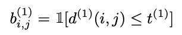

# [SIMPLE ONLINE AND REALTIME TRACKING WITH A DEEP ASSOCIATION METRIC](https://arxiv.org/pdf/1703.07402.pdf)
簡易まとめ：自分の言葉でまとめたもの。  
GPT翻訳：GPTで翻訳した全文。  

## 簡易まとめ
### abstract
Simple Online and Realtime Tracking (SORT)は、複数のオブジェクトトラッキングの方法である。  
本論では、外観情報を活用してSORTを改良する。改良により、長い時間遮蔽されてもトラッキングが可能となった。  
先行研究に則り、人物のデータセットを用いてオフラインで学習を実施し、オンラインでトラッキングを実行する。  
開発手法を実験し、既存手法に比べてトラッキングのミスを45%減少させつつ、高いフレームレートでの実行を実現した。  

### 1. introduction
物体検出技術の進歩により、最近は複数の物体追跡の研究が盛り上がっている。  
従来の物体追跡は、バッチ処理にて実施しており、flow network formulationやprobabilistic graphical modelなどが存在する。  
しかしバッチ処理であるため、リアルタイムな利用には向いていない。  
更に伝統的な手法として、Multiple Hypothesis Tracking (MHT)やJoint Probabilistic Data Association Filter (JPDAF)がある。  
これらも有用ではあるが、計算方法や実装が困難であるという課題がある。  

Simple online and realtime tracking (SORT)は、カルマンフィルタとハンガリアン法を用いた物体追跡の手法である。  
簡単な処理の流れは以下で、高速で性能が高い。  
1. BBOXを各フレームで検出
2. カルマンフィルタで位置推定
3. ハンガリアン法で前フレームと現フレームのBBOXを関連付け
4. BBOXの重なりで正しさを評価
5. 結果を用いて、カルマンフィルタの状態を更新

図1: 物体追跡タスクのイメージ。手前の人とすれ違う時に、検出IDを維持することが課題になる。      

SORTは優秀だが、オブジェクトが隠れると追跡対象を取り違えることが多々ある。これは、ハンガリアン法での関連付けの確信度が低いと異なる物体であると認識するためである。  
これに対し提案手法は、motion(運動)とappearance information(外観情報)を物体の関連付けに利用することで克服する。  
BBOX検出用のモデルは、人間の学習済みモデルを利用する。  
これにより、長時間遮蔽されてもロバストに追跡する方法を提案する。提案手法の[コード](https://github.com/nwojke/deep_sort)を公開している。  

### 2. SORT WITH DEEP ASSOCIATION METRIC
本手法は、再帰的なカルマンフィルタリングとフレームごとのデータ関連付けを伴う従来の単一仮説追跡方法を採用している。  
以下で各コンポーネントを説明する。  

#### 2.1. Track Handling and State Estimation
物体追跡の扱いとカルマンフィルタの利用は、オリジナルの論文の物と同一である。  
動画の撮影状態は、近年の研究によく見られるシチュエーションで、カメラの補正がされていない・自己運動情報（ego-motion）がないことを想定している。  

物体追跡に対し、8次元の状態空間( $u$ , $v$ , $γ$ , $h$ , $\dot{x}$ , $\dot{y}$ , $\dot{γ}$ , $\dot{a}$ )に基づいて定義する。  
各次元の値は以下。  
$u$ , $v$: バウンディングボックスの中心座標  
$γ$: バウンディングボックスのアスペクト比  
$h$: バウンディングボックスの高さ  
$\dot{x}$ , $\dot{y}$ , $\dot{γ}$ , $\dot{a}$: それぞれの画像内の加速度。  

定速度運動と線形観測モデルを備えた標準的なカルマンフィルターを用い、  
オブジェクト状態の直接的な観測としてバウンディングボックスの情報($u$, $v$, $γ$, $h$)を取得する。

各トラックkについて、最後の成功した測定関連付け$a_k$ からのフレーム数をカウントします。  
このカウンターは、カルマンフィルターの予測中に増加し、トラックが測定と関連付けられたときに0にリセットされます。  
定義済みの最大年齢$A_max$ を超えるトラックは、シーンから離れたと見なされ、トラックセットから削除されます。  
既存のトラックに関連付けられない各検出に対して、新しいトラック仮説が開始されます。  
これらの新しいトラックは、最初の3フレームの間、暫定的として分類されます。  
この期間中、各タイムステップで成功した測定関連付けが期待されます。  
最初の3フレーム内で測定に成功した関連付けがなされないトラックは削除されます。

#### 2.2. Assignment Problem
予測されたカルマン状態と新たに到着した測定値との間の関連付けを解決する従来の方法は、ハンガリアンアルゴリズムを使用して解ける割り当て問題を構築することです。  
この問題定式化には、2つの適切なメトリックの組み合わせを通じて運動と外観情報を統合します。  
運動情報を取り入れるために、予測されたカルマン状態と新たに到着した測定値の間の（二乗）マハラノビス距離を使用します：
$d^{(1)}(i, j) = (d_j - y_i)^T S_i^{-1}(d_j - y_i)$  
ここで、 i番目のトラック分布の測定空間への投影を $(y_i, S_i)$ 、 j番目のバウンディングボックス検出を $d_j$ と表します。  
マハラノビス距離は、検出が平均トラック位置から何標準偏差離れているかを測定することで、状態推定の不確実性を考慮します。  
さらに、このメトリックを使用することで、逆 $χ^2$ 分布から計算された95%信頼区間でマハラノビス距離をしきい値処理することにより、考えられない関連付けを排除することが可能です。  
この決定を、 i番目のトラックと j番目の検出との間の関連付けが許容される場合に1と評価される指標  
  

## GPT翻訳
### abstract
Simple Online and Realtime Tracking (SORT)は、シンプルで効果的なアルゴリズムに焦点を当てた、複数オブジェクト追跡の実用的な手法です。  
この論文では、SORTの性能を向上させるために外観情報を統合しています。  
この拡張により、より長い期間の遮蔽を通じてオブジェクトを追跡し、身元の切り替えの数を効果的に減少させることが可能になりました。  
元のフレームワークの精神に則り、計算の複雑さの多くをオフラインの事前学習段階に置き、大規模な人物再識別データセットで深い関連メトリックを学習します。  
オンラインアプリケーション中には、視覚外観空間での最近傍クエリを使用して、測定とトラックの関連付けを確立します。  
実験評価では、私たちの拡張によって身元の切り替えの数が45%減少し、高いフレームレートで全体的に競争力のある性能を達成しています。  

### 1. introduction
オブジェクト検出の最近の進歩により、検出による追跡が複数オブジェクト追跡の主要なパラダイムになりました。  
このパラダイムでは、オブジェクトの軌跡は通常、ビデオバッチ全体を一度に処理するグローバル最適化問題で見つかります。  
例えば、フローネットワークの定式化や確率的グラフィカルモデルが、このタイプの人気フレームワークとなっています。  
しかし、バッチ処理のため、これらの方法は、各タイムステップでターゲットの身元が利用可能である必要があるオンラインシナリオには適用できません。  
より伝統的な方法には、Multiple Hypothesis Tracking (MHT)やJoint Probabilistic Data Association Filter (JPDAF)があります。  
これらの方法は、フレームごとにデータ関連付けを実行します。  
JPDAFでは、個々の測定値をその関連付けの尤度で重み付けすることによって、単一の状態仮説が生成されます。  
MHTでは、すべての可能な仮説が追跡されますが、計算の実行可能性のために剪定スキームを適用する必要があります。  
両方の方法は、検出による追跡シナリオで最近再検討され、有望な結果を示しました。  
しかし、これらの方法の性能は、計算および実装の複雑さを増加させます。  

Simple online and realtime tracking (SORT)は、イメージ空間でのカルマンフィルタリングと、  
バウンディングボックスのオーバーラップを測定する関連付けメトリックを使用したハンガリアン方法によるフレームごとのデータ関連付けを実行する、  
はるかにシンプルなフレームワークです。  
このシンプルなアプローチは、高いフレームレートで好ましい性能を達成します。  
MOTチャレンジデータセットで、最先端の人物検出器を備えたSORTは、標準検出でMHTよりも平均的に高いランクを獲得します。  
これは、オブジェクト検出器の性能が全体の追跡結果に与える影響を強調するだけでなく、実践者の観点からも重要な洞察です。  

図1: MOTチャレンジデータセットでの、頻繁な遮蔽がある一般的な追跡状況における、私たちの方法の例示的な出力。  

SORTは追跡の精度と正確さの面で全体的に良い性能を達成していますが、比較的多くの身元切り替えを返します。  
これは、使用されている関連付けメトリックが状態推定の不確実性が低い場合にのみ正確であるためです。  
したがって、SORTは、通常、正面からのカメラシーンで現れるような遮蔽を通じての追跡において欠点があります。  
私たちは、この問題を、運動と外観情報を組み合わせたより情報に基づいたメトリックに関連付けメトリックを置き換えることによって克服します。  
特に、大規模な人物再識別データセットで歩行者を区別するために訓練された畳み込みニューラルネットワーク（CNN）を適用します。  
このネットワークの統合を通じて、私たちは、システムを実装しやすく、効率的で、オンラインシナリオに適用可能に保ちながら、見逃しや遮蔽に対するロバスト性を向上させます。  
研究実験と実用的なアプリケーション開発を促進するために、私たちのコードと事前に訓練されたCNNモデルを公開しています。  

### 2. SORT WITH DEEP ASSOCIATION METRIC
私たちは、再帰的なカルマンフィルタリングとフレームごとのデータ関連付けを伴う従来の単一仮説追跡方法を採用しています。  
以下のセクションでは、このシステムの核となるコンポーネントをさらに詳しく説明します。  

#### 2.1. Track Handling and State Estimation
トラック処理とカルマンフィルタリングフレームワークは、主に[12]でのオリジナルの定式化と同一です。  
非常に一般的な追跡シナリオを想定しており、カメラが校正されておらず、自己運動情報が利用できない状況です。  
これらの状況はフィルタリングフレームワークにとって課題をもたらしますが、最近の複数オブジェクト追跡ベンチマークで考慮されている最も一般的な設定です。  
したがって、私たちの追跡シナリオは、バウンディングボックスの中心位置(u, v)、アスペクト比γ、高さh、  
およびそれぞれの画像座標における速度を含む8次元状態空間(u, v, γ, h, x˙, y˙, γ˙, h˙)に基づいて定義されます。  
私たちは、定速度運動と線形観測モデルを備えた標準的なカルマンフィルターを使用し、  
オブジェクト状態の直接的な観測としてバウンディング座標(u, v, γ, h)を取ります。

各トラックkについて、最後の成功した測定関連付け$a_k$ からのフレーム数をカウントします。  
このカウンターは、カルマンフィルターの予測中に増加し、トラックが測定と関連付けられたときに0にリセットされます。  
定義済みの最大年齢$A_max$ を超えるトラックは、シーンから離れたと見なされ、トラックセットから削除されます。  
既存のトラックに関連付けられない各検出に対して、新しいトラック仮説が開始されます。  
これらの新しいトラックは、最初の3フレームの間、暫定的として分類されます。  
この期間中、各タイムステップで成功した測定関連付けが期待されます。  
最初の3フレーム内で測定に成功した関連付けがなされないトラックは削除されます。

#### 2.2. Assignment Problem
予測されたカルマン状態と新たに到着した測定値との間の関連付けを解決する従来の方法は、ハンガリアンアルゴリズムを使用して解ける割り当て問題を構築することです。  
この問題定式化には、2つの適切なメトリックの組み合わせを通じて運動と外観情報を統合します。  
運動情報を取り入れるために、予測されたカルマン状態と新たに到着した測定値の間の（二乗）マハラノビス距離を使用します：
$d^{(1)}(i, j) = (d_j - y_i)^T S_i^{-1}(d_j - y_i)$  
ここで、 i番目のトラック分布の測定空間への投影を $(y_i, S_i)$ 、 j番目のバウンディングボックス検出を $d_j$ と表します。  
マハラノビス距離は、検出が平均トラック位置から何標準偏差離れているかを測定することで、状態推定の不確実性を考慮します。  
さらに、このメトリックを使用することで、逆 $χ^2$ 分布から計算された95%信頼区間でマハラノビス距離をしきい値処理することにより、考えられない関連付けを排除することが可能です。  
この決定を、 i番目のトラックと j番目の検出との間の関連付けが許容される場合に1と評価される指標  
  

で表します。私たちの4次元測定空間に対応するマハラノビスしきい値は $t^{(1)} = 9.4877$ です。  

マハラノビス距離は、動きの不確かさが低い場合に適切な関連付け指標ですが、我々の画像空間の問題定式化では、  
カルマンフィルタリングフレームワークから得られる予測状態分布がオブジェクトの位置の大まかな推定しか提供しません。  
特に、考慮されていないカメラの動きは画像平面内で急激な移動を引き起こす可能性があり、これによりマハラノビス距離は遮蔽を通じた追跡にあまり情報を提供しない指標となります。  
したがって、我々は割り当て問題に第二の指標を統合します。  
各バウンディングボックス検出 $d_j$ に対して、外観記述子 $r_j$ を計算し、そのノルム $||r_j||$ が1になるようにします。  
さらに、各トラックkについて、最後のLk=100の関連付けられた外観記述子のギャラリーRk={r_k^(i)}(k=1)^(Lk)を保持します。  
そして、我々の第二の指標は、i番目のトラックとj番目の検出の外観空間における最小のコサイン距離を測定します：
d(2)(i, j) = min{1 − rj^Tr_k^(i) | r_k^(i) ∈ Ri}。（式3）
再び、この指標に従って関連付けが許容されるかどうかを示すために二値変数を導入します：
b_(2)i,j = 1[d_(2)(i, j) ≤ t_(2)] （式4）
そして、この指標の適切なしきい値を別のトレーニングデータセットで見つけます。実際には、事前訓練されたCNNを適用してバウンディングボックスの外観記述子を計算します。このネットワークのアーキテクチャはセクション2.4で説明されています。

