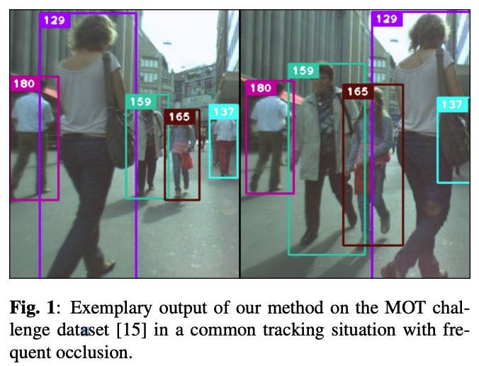
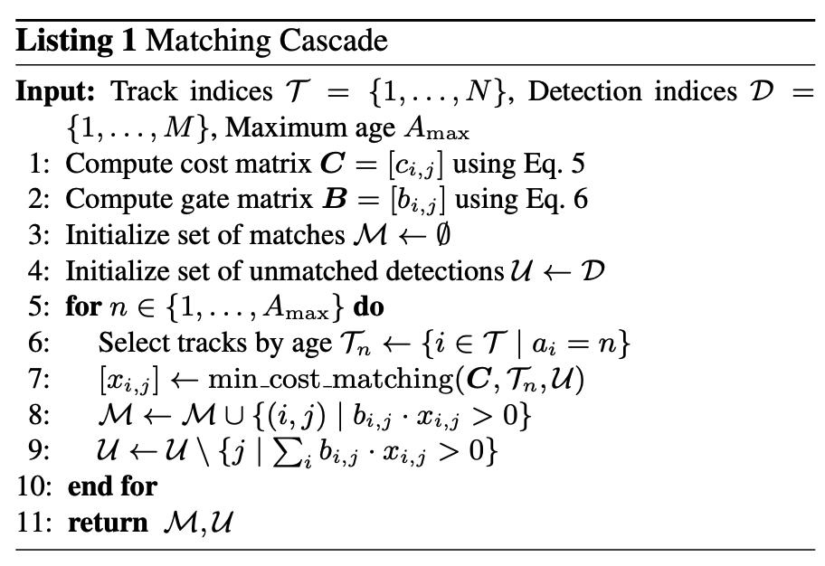
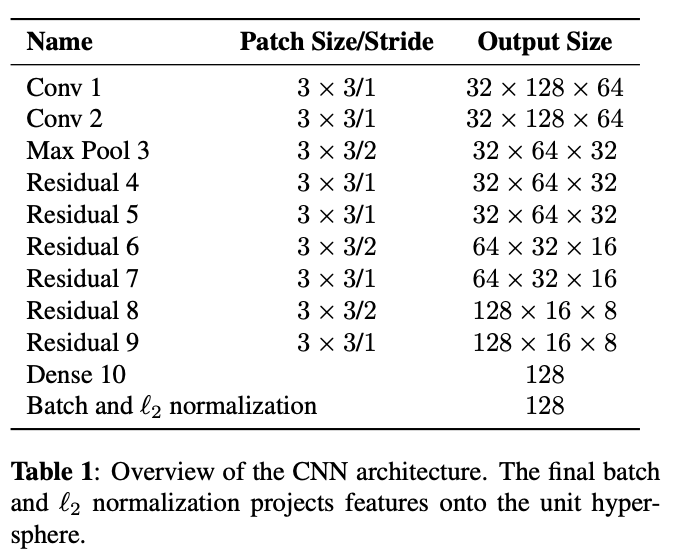

# [SIMPLE ONLINE AND REALTIME TRACKING WITH A DEEP ASSOCIATION METRIC](https://arxiv.org/pdf/1703.07402.pdf)
簡易まとめ：自分の言葉でまとめたもの。  
GPT翻訳：GPTで翻訳した全文。  

## 簡易まとめ
### abstract
Simple Online and Realtime Tracking (SORT)は、複数のオブジェクトトラッキングの方法である。  
本論では、外観情報を活用してSORTを改良する。改良により、長い時間遮蔽されてもトラッキングが可能となった。  
先行研究に則り、人物のデータセットを用いてオフラインで学習を実施し、オンラインでトラッキングを実行する。  
開発手法を実験し、既存手法に比べてトラッキングのミスを45%減少させつつ、高いフレームレートでの実行を実現した。  

### 1. introduction
物体検出技術の進歩により、最近は複数の物体追跡の研究が盛り上がっている。  
従来の物体追跡は、バッチ処理にて実施しており、flow network formulationやprobabilistic graphical modelなどが存在する。  
しかしバッチ処理であるため、リアルタイムな利用には向いていない。  
更に伝統的な手法として、Multiple Hypothesis Tracking (MHT)やJoint Probabilistic Data Association Filter (JPDAF)がある。  
これらも有用ではあるが、計算方法や実装が困難であるという課題がある。  

Simple online and realtime tracking (SORT)は、カルマンフィルタとハンガリアン法を用いた物体追跡の手法である。  
簡単な処理の流れは以下で、高速で性能が高い。  
1. BBOXを各フレームで検出
2. カルマンフィルタで位置推定
3. ハンガリアン法で前フレームと現フレームのBBOXを関連付け
4. BBOXの重なりで正しさを評価
5. 結果を用いて、カルマンフィルタの状態を更新

図1: 物体追跡タスクのイメージ。手前の人とすれ違う時に、検出IDを維持することが課題になる。      


SORTは優秀だが、オブジェクトが隠れると追跡対象を取り違えることが多々ある。これは、ハンガリアン法での関連付けの確信度が低いと異なる物体であると認識するためである。  
これに対し提案手法は、motion(運動)とappearance information(外観情報)を物体の関連付けに利用することで克服する。  
BBOX検出用のモデルは、人間の学習済みモデルを利用する。  
これにより、長時間遮蔽されてもロバストに追跡する方法を提案する。提案手法の[コード](https://github.com/nwojke/deep_sort)を公開している。  

### 2. SORT WITH DEEP ASSOCIATION METRIC
本手法は、再帰的なカルマンフィルタリングとフレームごとのデータ関連付けを伴う従来の単一仮説追跡方法を採用している。  
以下で各コンポーネントを説明する。  

#### 2.1. Track Handling and State Estimation
物体追跡の扱いとカルマンフィルタの利用は、オリジナルの論文の物と同一である。  
動画の撮影状態は、近年の研究によく見られるシチュエーションで、カメラの補正がされていない・自己運動情報（ego-motion）がないことを想定している。  

物体追跡に対し、8次元の状態空間( $u$ , $v$ , $γ$ , $h$ , $\dot{x}$ , $\dot{y}$ , $\dot{γ}$ , $\dot{a}$ )に基づいて定義する。  
各次元の値は以下。  
$u$ , $v$: バウンディングボックスの中心座標  
$γ$: バウンディングボックスのアスペクト比  
$h$: バウンディングボックスの高さ  
$\dot{x}$ , $\dot{y}$ , $\dot{γ}$ , $\dot{a}$: それぞれの画像内の加速度。  

定速度運動と線形観測モデルを備えた標準的なカルマンフィルターを用い、  
オブジェクト状態の直接的な観測としてバウンディングボックスの情報($u$, $v$, $γ$, $h$)を取得する。

各追跡しているtrack$k$について、最後に観測に成功してからのフレーム数 $a_k$をカウントする。  
このカウントは、追跡するための物体管理に利用する。  
具体的には、このカウンター $a_k$は、カルマンフィルタの予測中に増えていき、  
既存のtrackが新しいフレームでの検出オブジェクトに関連付けられると0にリセットされる。  
カウンターが指定する$A_max$の数を超えると、動画から消えたと見なされ、トラックセットから削除する。  
既存のtrackに関連付けられない物体には、新しいtrackが開始されて、追跡対象となる。  
新しいtrackは、最初の3フレームの間、暫定的に新trackに分類する。  
最初の3フレーム内で測定に成功した関連付けがなされないtrackは、後検出として削除する。  

#### 2.2. Assignment Problem
カルマンフィルタで予測した状態の関連付けは、従来の方法だと ハンガリアンアルゴリズムで実現する。  
ここに、motion(運動)とappearance information(外観情報)を追加する。  
motion(運動)情報を取り入れるため、予測したカルマンフィルタでの状態と、新しいフレームでの状態の間でマハラノビス距離を使用する。  

```math
d^{(1)}(i, j) = (d_j - y_i)^T S_i^{-1}(d_j - y_i)
```

この時、それぞれの意味合いは以下。  
$d^{(1)}(i, j)$: i番目のtrackとj番目のボックスのマハラノビス距離  
$d_j$: j番目のバウンディングボックス  
$y_i$: i番目のtrackの予測位置  
S_i^{-1}: i番目のトラックの予測位置の共分散(不確実性)  

これを用いることで、検出したボックスがここまでの平均トラック位置からどれくらい離れているかを確認でき、推定結果の不確実性を考慮できる。  
さらに、逆 $χ^2$ 分布から計算する95%信頼区間で正しいかどうかを判定する。  
以下の計算にて、この決定をする。  
```math
b_{i, j}^{(1)} = 1[d^{(1)}(i, j) \leq t^{(1)}] 
```

この時、それぞれの意味合いは以下。  
$b_{i, j}^{(1)}$: i番目の追跡対象とj番目の検出されたボックスの関連(1: 関連あり、0: 関連なし)  
$d^{(1)}(i, j)$: マハラノビス距離  
$t^{(1)}$: 閾値。本論文では、0.948755を用いる  

これを、$u$ , $v$ , $γ$ , $h$の4つの次元で判定する。  

マハラノビス距離の評価指標は、物体の動きのブレが少ない場合に有力である。  
しかし、実際にはカメラが大きく動くなどの大きなブレが発生するとロバスト性に欠ける危険性がある。  
そこで別の評価指標を取り入れる。  
各検出されたバウンディングボックス $d_j$ について、見た目を表す特徴(appearance detector) $γ_j$ を計算する。($||γ_j|| =1$ ノルムが1=大きさが1)  
追跡している各trackにて、直近の100個の $γ_j$ を以下のイメージで集合として保持しておく。  

```math
R_k = \left\{ r_k^{(i)} \right\}_{k=1}^{L_k}
```

そして、i番目のtrackとj番目の検出されたバウンディングボックスについて、コサイン類似度を計算する。  

```math
d^{(2)}(i, j) = \min\left\{1 - r_j^\top r_k^{(i)} \mid r_k^{(i)} \in R_j\right\}
```

これにより、新しいフレームで取得した見た目を表す特徴と、過去の保持した特徴との最小の距離を算出する。(最小なのは、最も距離が離れた時で判定するため)  
これも0か1の値を返却し、以下のように判定する。  

```math
b_{i, j}^{(2)} = 1[d^{(2)}(i, j) \leq t^{(2)}] 
```

このしきい値は、別のトレーニングデータセットで発見する。  
事前学習済みのCNNのネットワークで実施するが、ネットワークのアーキテクチャはセクション2.4で説明する。  

このx,y,γ,hでのマハラノビス距離と、見た目を表す特徴のコサイン類似度の両方の指標を組み合わせ、BBOXの関連性を計算する。  
マハラノビス距離は、特に短期予測に有用で、運動(motion)に基づいたオブジェクトの位置情報を提供する。  
コサイン距離は、特に長期間の遮蔽後にアイデンティティを回復するのに有用な、appearance information(外観情報)を考慮する。  
この二つが補完しあうように作られている。  
そして以下のように、この二つを組み合わせて、確信度を算出する。  

```math
c_{i, j} = λ d^{(1)} (i, j) + (1 - λ) d^{(2)} (i, j)
```

ここで、両方の指標のが1である場合に、新規のボックスが既存のボックスと関連すると判断する。  

```math
b_{i, j} = \prod_{m=1}^{2}b_{i, j}^(m)
```

2つの指標の重要度はλでコントロールする。  
実験の結果、カメラの動きが大きい場合、 $λ=0$ が最もよかった。これは、マハラノビス距離を使用しない設定である。  
しかし、マハラノビスゲート閾値としての利用はする。  
これは、あまりにもあり得ない位置のボックスをtrackから外すことに有用である。  

#### 2.3. Matching Cascade
既存のtrackと予測されたボックスの割り当てをするためのmatching cascadeを導入している。  
オブジェクトが長いフレームで隠蔽されると、様々な場所に次出現する可能性が増えるため、状態空間の中で確率質量(probability mass)が広がる。  
マハラノビス距離は平均と分散・共分散行列を利用するため、正確な予測が困難となる。(遠くにいても、異常と判断されにくくなる。)  
これは望ましくない動きであるため、これを考慮して、頻繁に検出できるオブジェクトを優先的に利用するようにしている。  

リスト1に、マッチングアルゴリズムの概要を示す。  

リスト1: マッチングアルゴリズムイメージ  


入力は、トラックの集合 $T$、検出の集合 $D$、候補を継続する最大フレーム数 $A_{max}$。  
1,2行目: コスト関数とゲート関数を計算する。  
3,4行目: 一致した検出と不一致の検出の集合の初期化。  
5~10行目: trackの計測フレーム数分処理を繰り返す。  
6行目: 過去nフレームで検出と関連付けられていないトラックのサブセット $T_n$ を取得する。  
7行目: 関連付いていないトラック$T_n$ と検出されたがまだマッチするトラックを持たない $U$ を対応付ける。
8,9行目: 一致した検出と不一致の検出の集合を更新する。  

※　このマッチングは、最近見られたトラックを優先する。(って書いてあるけど、どの辺でこれを考慮しているのかが不明。。)  

最終的なマッチングステージで、過去フレーム数 $n=1$ の未確認および一致していないトラックのセットに対し、IOUで関連付をする。
これは、部分的な遮蔽などで外観情報が大きく変わることがあるため、IOUでの関連付けをすることで、見た目の変化にも堅牢にするためである。  

#### 2.4. Deep Appearance Descriptor
外観情報を取得するために、事前学習済みのCNNを利用する。これは、1,100,000枚以上の画像と1,261人の歩行者で学習したものである。
表1に、CNNアーキテクチャを示す。  

表1: CNNアーキテクチャ


2つの畳み込み層、6つの残差ブロック、線型結合層、batch normalizationとL2 normalizationを通して、得られたベクトルで外観情報とする。  
パラメータ数は2,800,864で、32のバウンディングボックスの1回の推論時間は、GTX1050で約30msであり、高速。  
この学習済みモデルは公開している。  

### 3. EXPERIMENTS


## GPT翻訳
### abstract
Simple Online and Realtime Tracking (SORT)は、シンプルで効果的なアルゴリズムに焦点を当てた、複数オブジェクト追跡の実用的な手法です。  
この論文では、SORTの性能を向上させるために外観情報を統合しています。  
この拡張により、より長い期間の遮蔽を通じてオブジェクトを追跡し、身元の切り替えの数を効果的に減少させることが可能になりました。  
元のフレームワークの精神に則り、計算の複雑さの多くをオフラインの事前学習段階に置き、大規模な人物再識別データセットで深い関連メトリックを学習します。  
オンラインアプリケーション中には、視覚外観空間での最近傍クエリを使用して、測定とトラックの関連付けを確立します。  
実験評価では、私たちの拡張によって身元の切り替えの数が45%減少し、高いフレームレートで全体的に競争力のある性能を達成しています。  

### 1. introduction
オブジェクト検出の最近の進歩により、検出による追跡が複数オブジェクト追跡の主要なパラダイムになりました。  
このパラダイムでは、オブジェクトの軌跡は通常、ビデオバッチ全体を一度に処理するグローバル最適化問題で見つかります。  
例えば、フローネットワークの定式化や確率的グラフィカルモデルが、このタイプの人気フレームワークとなっています。  
しかし、バッチ処理のため、これらの方法は、各タイムステップでターゲットの身元が利用可能である必要があるオンラインシナリオには適用できません。  
より伝統的な方法には、Multiple Hypothesis Tracking (MHT)やJoint Probabilistic Data Association Filter (JPDAF)があります。  
これらの方法は、フレームごとにデータ関連付けを実行します。  
JPDAFでは、個々の測定値をその関連付けの尤度で重み付けすることによって、単一の状態仮説が生成されます。  
MHTでは、すべての可能な仮説が追跡されますが、計算の実行可能性のために剪定スキームを適用する必要があります。  
両方の方法は、検出による追跡シナリオで最近再検討され、有望な結果を示しました。  
しかし、これらの方法の性能は、計算および実装の複雑さを増加させます。  

Simple online and realtime tracking (SORT)は、イメージ空間でのカルマンフィルタリングと、  
バウンディングボックスのオーバーラップを測定する関連付けメトリックを使用したハンガリアン方法によるフレームごとのデータ関連付けを実行する、  
はるかにシンプルなフレームワークです。  
このシンプルなアプローチは、高いフレームレートで好ましい性能を達成します。  
MOTチャレンジデータセットで、最先端の人物検出器を備えたSORTは、標準検出でMHTよりも平均的に高いランクを獲得します。  
これは、オブジェクト検出器の性能が全体の追跡結果に与える影響を強調するだけでなく、実践者の観点からも重要な洞察です。  

図1: MOTチャレンジデータセットでの、頻繁な遮蔽がある一般的な追跡状況における、私たちの方法の例示的な出力。  


SORTは追跡の精度と正確さの面で全体的に良い性能を達成していますが、比較的多くの身元切り替えを返します。  
これは、使用されている関連付けメトリックが状態推定の不確実性が低い場合にのみ正確であるためです。  
したがって、SORTは、通常、正面からのカメラシーンで現れるような遮蔽を通じての追跡において欠点があります。  
私たちは、この問題を、運動と外観情報を組み合わせたより情報に基づいたメトリックに関連付けメトリックを置き換えることによって克服します。  
特に、大規模な人物再識別データセットで歩行者を区別するために訓練された畳み込みニューラルネットワーク（CNN）を適用します。  
このネットワークの統合を通じて、私たちは、システムを実装しやすく、効率的で、オンラインシナリオに適用可能に保ちながら、見逃しや遮蔽に対するロバスト性を向上させます。  
研究実験と実用的なアプリケーション開発を促進するために、私たちのコードと事前に訓練されたCNNモデルを公開しています。  

### 2. SORT WITH DEEP ASSOCIATION METRIC
私たちは、再帰的なカルマンフィルタリングとフレームごとのデータ関連付けを伴う従来の単一仮説追跡方法を採用しています。  
以下のセクションでは、このシステムの核となるコンポーネントをさらに詳しく説明します。  

#### 2.1. Track Handling and State Estimation
トラック処理とカルマンフィルタリングフレームワークは、主に[12]でのオリジナルの定式化と同一です。  
非常に一般的な追跡シナリオを想定しており、カメラが校正されておらず、自己運動情報が利用できない状況です。  
これらの状況はフィルタリングフレームワークにとって課題をもたらしますが、最近の複数オブジェクト追跡ベンチマークで考慮されている最も一般的な設定です。  
したがって、私たちの追跡シナリオは、バウンディングボックスの中心位置(u, v)、アスペクト比γ、高さh、  
およびそれぞれの画像座標における速度を含む8次元状態空間(u, v, γ, h, x˙, y˙, γ˙, h˙)に基づいて定義されます。  
私たちは、定速度運動と線形観測モデルを備えた標準的なカルマンフィルターを使用し、  
オブジェクト状態の直接的な観測としてバウンディング座標(u, v, γ, h)を取ります。

各トラックkについて、最後の成功した測定関連付け$a_k$ からのフレーム数をカウントします。  
このカウンターは、カルマンフィルターの予測中に増加し、トラックが測定と関連付けられたときに0にリセットされます。  
定義済みの最大年齢$A_max$ を超えるトラックは、シーンから離れたと見なされ、トラックセットから削除されます。  
既存のトラックに関連付けられない各検出に対して、新しいトラック仮説が開始されます。  
これらの新しいトラックは、最初の3フレームの間、暫定的として分類されます。  
この期間中、各タイムステップで成功した測定関連付けが期待されます。  
最初の3フレーム内で測定に成功した関連付けがなされないトラックは削除されます。

#### 2.2. Assignment Problem
予測されたカルマン状態と新たに到着した測定値との間の関連付けを解決する従来の方法は、ハンガリアンアルゴリズムを使用して解ける割り当て問題を構築することです。  
この問題定式化には、2つの適切なメトリックの組み合わせを通じて運動と外観情報を統合します。  
運動情報を取り入れるために、予測されたカルマン状態と新たに到着した測定値の間の（二乗）マハラノビス距離を使用します：
$d^{(1)}(i, j) = (d_j - y_i)^T S_i^{-1}(d_j - y_i)$  
ここで、 i番目のトラック分布の測定空間への投影を $(y_i, S_i)$ 、 j番目のバウンディングボックス検出を $d_j$ と表します。  
マハラノビス距離は、検出が平均トラック位置から何標準偏差離れているかを測定することで、状態推定の不確実性を考慮します。  
さらに、このメトリックを使用することで、逆 $χ^2$ 分布から計算された95%信頼区間でマハラノビス距離をしきい値処理することにより、考えられない関連付けを排除することが可能です。  
この決定を、 i番目のトラックと j番目の検出との間の関連付けが許容される場合に1と評価される指標  

```math
b_{i, j}^{(1)} = 1[d^{(1)}(i, j) \leq t^{(1)}] 
```

で表します。私たちの4次元測定空間に対応するマハラノビスしきい値は $t^{(1)} = 9.4877$ です。  

マハラノビス距離は、動きの不確かさが低い場合に適切な関連付け指標ですが、我々の画像空間の問題定式化では、  
カルマンフィルタリングフレームワークから得られる予測状態分布がオブジェクトの位置の大まかな推定しか提供しません。  
特に、考慮されていないカメラの動きは画像平面内で急激な移動を引き起こす可能性があり、これによりマハラノビス距離は遮蔽を通じた追跡にあまり情報を提供しない指標となります。  
したがって、我々は割り当て問題に第二の指標を統合します。  
各バウンディングボックス検出 $d_j$ に対して、外観記述子 $r_j$ を計算し、そのノルム $||r_j||$ が1になるようにします。  
さらに、各トラックkについて、最後のLk=100の関連付けられた外観記述子のギャラリーRk={r_k^(i)}(k=1)^(Lk)を保持します。  
そして、我々の第二の指標は、i番目のトラックとj番目の検出の外観空間における最小のコサイン距離を測定します：
d(2)(i, j) = min{1 − rj^Tr_k^(i) | r_k^(i) ∈ Ri}。（式3）
再び、この指標に従って関連付けが許容されるかどうかを示すために二値変数を導入します：
b_(2)i,j = 1[d_(2)(i, j) ≤ t_(2)] （式4）
そして、この指標の適切なしきい値を別のトレーニングデータセットで見つけます。実際には、事前訓練されたCNNを適用してバウンディングボックスの外観記述子を計算します。このネットワークのアーキテクチャはセクション2.4で説明されています。

両方の指標を組み合わせることで、割り当て問題の異なる側面を補完し合います。  
一方で、マハラノビス距離は、特に短期予測に有用な、運動に基づいた可能なオブジェクトの位置情報を提供します。  
一方、コサイン距離は、特に長期間の遮蔽後にアイデンティティを回復するのに有用な、外観情報を考慮します。  
運動が識別力を持たなくなる時、特に役立ちます。  
関連付け問題を構築するために、これら両方の指標を重み付き和を使用して組み合わせます。  

```math
c_{i, j} = λ d^{(1)} (i, j) + (1 - λ) d^{(2)} (i, j)
```

ここで、両方の指標のゲーティング領域内にある場合、関連付けを許容されるものとします。

```math
b_{i, j} = \prod_{m=1}^{2}b_{i, j}^(m)
```

組み合わせた関連付けコストにおける各指標の影響は、ハイパーパラメータ　$λ$ を通じて制御できます。  
私たちの実験では、カメラの動きが顕著な場合に $λ=0$ を設定することが合理的な選択であることがわかりました。  
この設定では、関連付けコスト項に外観情報のみが使用されます。  
しかし、マハラノビスゲートは依然として使用され、カルマンフィルタによって推測された可能なオブジェクトの位置に基づいて実現不可能な割り当てを除外します。  

#### 2.3. Matching Cascade
測定値とトラックの関連付けをグローバルな割り当て問題として解決する代わりに、一連のサブプロブレムを解決するカスケードを導入します。  
このアプローチを動機付けるために、次の状況を考慮してください：  
オブジェクトが長期間遮蔽された場合、後続のカルマンフィルタの予測はオブジェクトの位置に関連する不確実性を増大させます。  
結果として、確率質量は状態空間内で広がり、観測の尤度はピークが低くなります。  
直感的には、関連付け指標はこの確率質量の広がりを測定値とトラックの距離の増加によって考慮するべきです。  
しかし反直感的に、2つのトラックが同じ検出と競合する場合、マハラノビス距離はより大きな不確実性を好むことになります。  
なぜなら、実質的に任意の検出に対する標準偏差の距離を投影されたトラック平均に向けて減少させるからです。  
これは望ましくない挙動であり、トラックの断片化の増加や不安定なトラックにつながる可能性があります。  
そのため、より頻繁に見られるオブジェクトに優先順位を付け、関連付け尤度における確率質量の広がりの概念を符号化するマッチングカスケードを導入します。  

リスト1では、マッチングアルゴリズムの概要を示しています。  


リスト1: マッチングアルゴリズムイメージ  

入力として、トラックの集合Tと検出Dのインデックス、および最大年齢A_maxを提供します。  
1行目と2行目では、関連付けコスト行列と許容される関連付けの行列を計算します。  
その後、トラックの年齢nについて反復処理を行い、年齢が増加するトラックに対して線形割り当て問題を解決します。  
6行目では、過去nフレームで検出と関連付けられていないトラックのサブセットT_nを選択します。  
7行目では、T_n内のトラックと未マッチの検出Uとの間で線形割り当てを解決します。  

8行目と9行目では、一致したトラックと一致していない検出のセットを更新し、11行目で完了後にこれらを返します。  
このマッチングの連鎖は、より小さな年齢のトラック、つまり最近見られたトラックを優先します。  

最終的なマッチングステージでは、元のSORTアルゴリズム[12]で提案されたように、年齢n=1の未確認および一致していないトラックのセットに対して、  
交差オーバーユニオン関連付けを実行します。  
これは、静的なシーンジオメトリによる部分的な遮蔽など、突然の外観変化を考慮し、誤った初期化に対する堅牢性を高めるのに役立ちます。  

#### 2.4. Deep Appearance Descriptor
追加のメトリック学習なしで単純な最近傍クエリを使用することにより、我々の方法の成功的な適用は、実際のオンライン追跡アプリケーションの前に、  
オフラインで訓練されたよく識別できる特徴埋め込みが必要です。  
この目的のために、我々は大規模な人物再識別データセットで訓練されたCNNを使用しています。  
このデータセットは1,100,000枚以上の画像と1,261人の歩行者を含んでおり、人物追跡の文脈での深層メトリック学習に非常に適しています。  

我々のネットワークのCNNアーキテクチャは表1に示されています。 


要約すると、我々は広い残差ネットワーク[22]を使用しており、2つの畳み込み層の後に6つの残差ブロックが続きます。  
次元数128のグローバル特徴マップは、密層10で計算されます。  
最終バッチおよびL2正規化は、特徴を我々のコサイン外観メトリックと互換性のある単位超球面に投影します。  
合計で、ネットワークには2,800,864のパラメータがあり、32のバウンディングボックスの1回のフォワードパスは、  
Nvidia GeForce GTX 1050モバイルGPU上で約30msかかります。  
したがって、このネットワークは、現代のGPUが利用可能であれば、オンライン追跡に非常に適しています。  
我々の訓練手順の詳細はこの論文の範囲外ですが、事前訓練されたモデルをGitHubリポジトリに提供し、特徴を生成するために使用できるスクリプトと共に提供します。

### 3. EXPERIMENTS
我々は、MOT16ベンチマークで我々のトラッカーの性能を評価します。  
このベンチマークは、移動カメラを伴う正面ビューのシーンや、上からの監視設定を含む、7つの難しいテストシーケンスでの追跡性能を評価します。  
トラッカーへの入力として、我々はYu et al.によって提供された検出に依存しています。  
彼らは、公開および非公開のデータセットのコレクションでFaster RCNNを訓練し、優れた性能を提供しています。  
公平な比較のために、我々は同じ検出でSORTを再実行しました。  

テストシーケンスの評価は、λ = 0およびAmax = 30フレームを使用して行われました。  
検出は信頼スコア0.3で閾値処理されています。  
我々の方法の残りのパラメータは、ベンチマークによって提供される別のトレーニングシーケンスで見つかりました。  
評価は以下の指標に従って行われます：  

- Multi-object tracking accuracy (MOTA)
偽陽性、偽陰性、およびIDスイッチの観点からの全体的な追跡精度。  

- Multi-object tracking precision (MOTP)
基準地と報告された位置のバウンディングボックスの重なりの観点からの全体的な追跡精度。

- Mostly tracked (MT)
少なくとも80%の期間同じラベルを持つ基準地のトラックの割合。

- Mostly lost(ML)
最大で20%の期間追跡される基準地のトラックの割合。

- Identity switches (ID)
基準地のトラックの報告された識別子が変更される回数。

- Fragmentation (FM)
トラックが検出されないことによって中断される回数。


